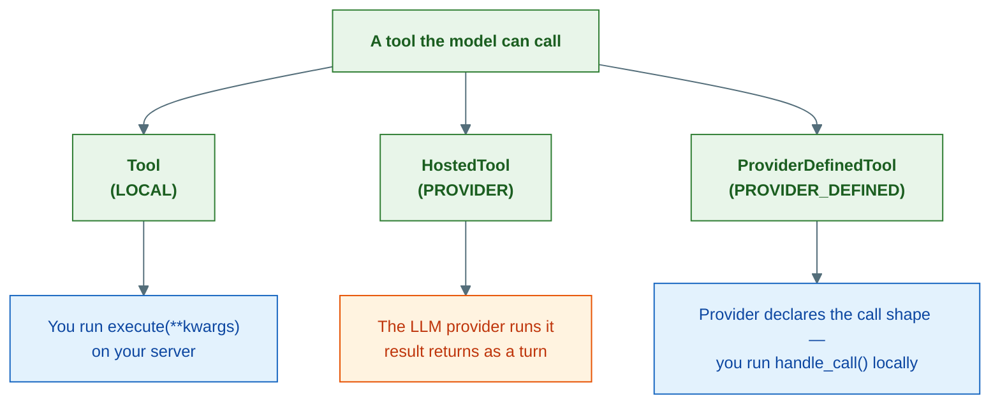
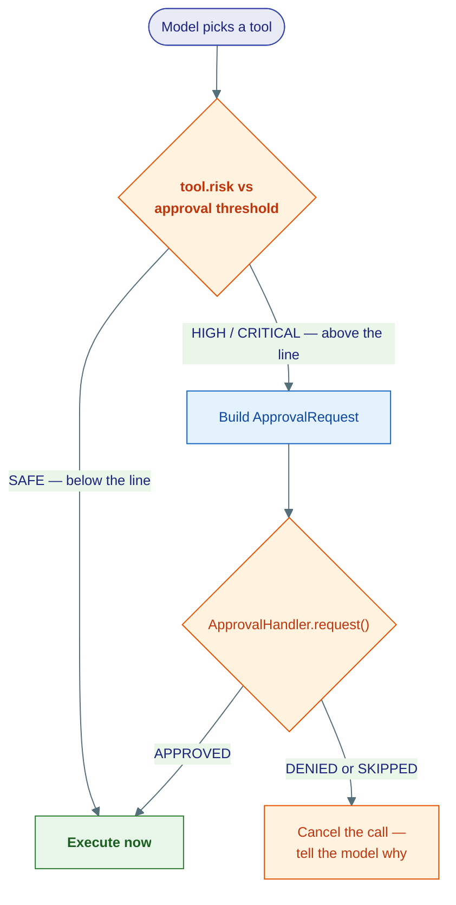
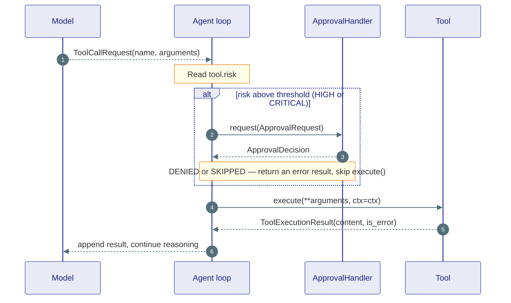
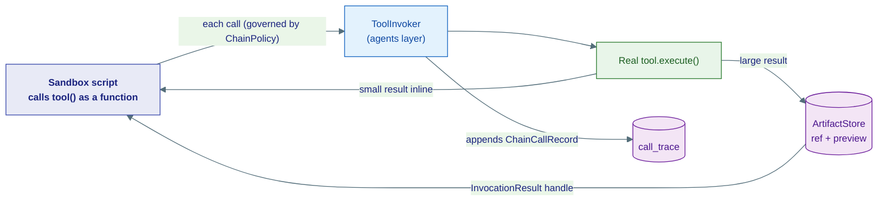

# Tool Contracts

## What this is

A language model can only emit text. The moment it needs to *do* something —
search the web, run a query, send an email, execute code — it has to reach for a
**tool**. This page is the kernel (layer L0) view of tools: the frozen
**contracts** — Protocols, dataclasses, and enums — that say what a tool *is*,
how risky it is, what a tool result looks like, how a human approves a dangerous
one, and how several tools can be chained inside a sandbox.

Think of tools as **apps the model can open** on a phone. The kernel here is not
the apps themselves and not the person tapping them — it is the *rules of the app
store*: every app must declare its name and what it does, must carry a safety
rating, and must hand back results in one agreed shape. The kernel writes those
rules. It never runs an app and never touches the network.

!!! note "This is the contract-level companion to a higher-level page"
    For the *story* of how tools are discovered, invoked, and shaped at runtime —
    the `ToolInvoker`, the catalog scanner, MCP — read [Tools](../concepts/tools.md).
    This page stays inside `kernel/tools/` and only documents the frozen types.
    Everything that actually executes a tool lives one layer up, in `agents/`.

The kernel ships four small files, and we cover each:

1. **`tools.py`** — the three-way tool taxonomy, risk tiers, and result shape.
2. **`approval.py`** — the human-in-the-loop (HITL) approval contract.
3. **`chain.py`** — the code-mode chaining value types.
4. **`skills.py`** — the prompt-skill contract.

---

## 1. Three kinds of tool

The hard part of a tool model is the edges: some tools run on *your* server, some
run *inside the LLM provider*, and some have a shape the provider defines but a
body *you* run. The kernel splits tools by one question — **who executes the
call?** — and gives each answer its own Protocol.

A **Protocol** is a structural contract: any object that has the right
attributes and methods *satisfies* it, with no base class to inherit. So a tool
is just a plain class that happens to have the right shape.



### Tool — LOCAL execution

The everyday tool. **You** declare a JSON schema for its arguments, and the agent
loop calls `tool.execute(**kwargs)` on your own server. This is the
`CalculatorTool` / `PostgresQueryTool` shape.

```python
class Tool(Protocol):
    name: str
    description: str
    input_schema: dict[str, object]

    async def execute(
        self, *, ctx: RunMeta | None = None, **kwargs: Any
    ) -> ToolExecutionResult: ...
```

`ctx` carries the execution deadline and cancellation token (see
[Core Primitives](01-core.md) for `RunMeta`). Optional attributes the agent layer
reads when present: `risk` (defaults to `ToolRisk.SAFE`), `tool_type` (defaults to
`ToolType.FUNCTION`), `ui` (a `ToolUI` declaration), and `defer_loading=True` to
withhold the full parameter schema until the model asks for it via `tool_search`.

### HostedTool — PROVIDER execution

A tool the **LLM provider runs natively**. The agent loop *never* calls
`execute()` — there isn't one. You only declare per-provider specs, and the
provider does the work; its result simply appears as the next turn in the
conversation. OpenAI's `web_search_preview`, `code_interpreter`, and `file_search`
are HostedTools.

```python
class HostedTool(Protocol):
    name: str
    description: str
    provider_specs: dict[str, JsonObject]   # keyed by "openai", "anthropic", ...
```

!!! warning "An absent provider key means 'drop me', not 'send me empty'"
    `provider_specs` is keyed by provider id. If a tool has no entry for the
    provider currently in use, encoders must **drop the tool**, not send a
    half-built spec. A malformed spec causes a provider API 400, which would
    break `FallbackClient` failover. This is why the kernel keeps specs typed.

### ProviderDefinedTool — PROVIDER_DEFINED execution

The hybrid. The **provider declares the call shape** (e.g. OpenAI's `shell_call`),
the model emits a typed call item in that shape, and **you execute it locally**
via `handle_call()`. OpenAI local `shell`, `apply_patch`, and `computer_use` are
ProviderDefinedTools.

```python
class ProviderDefinedTool(Protocol):
    name: str
    description: str
    provider_specs: dict[str, JsonObject]
    call_types: tuple[str, ...]            # e.g. ("shell_call",)

    async def handle_call(
        self, call: JsonObject, *, ctx: RunMeta | None = None
    ) -> JsonObject: ...
```

### The taxonomy at a glance

| Type | Execution mode | Who runs it | Key fields | Example |
|---|---|---|---|---|
| `Tool` | `LOCAL` | Your server, via `execute()` | `input_schema` + `execute()` | `CalculatorTool` |
| `HostedTool` | `PROVIDER` | The LLM provider | `provider_specs` only | OpenAI `web_search_preview` |
| `ProviderDefinedTool` | `PROVIDER_DEFINED` | You, via `handle_call()` | `provider_specs` + `call_types` + `handle_call()` | OpenAI `shell_call` |

All three are accepted anywhere via the union alias
`AnyTool = Tool | HostedTool | ProviderDefinedTool`, which `ToolRegistry`
stores.

### Telling them apart: the TypeGuard helpers

Both `HostedTool` and `ProviderDefinedTool` have `provider_specs`, so the kernel
ships two `TypeGuard` helpers to branch safely at dispatch time. The catch:
**check `is_provider_defined_tool` first**, because the difference is the presence
of `handle_call`.

```python
if is_provider_defined_tool(tool):       # has provider_specs AND handle_call
    out = await tool.handle_call(call, ctx=ctx)
elif is_hosted_tool(tool):               # has provider_specs, NO handle_call
    ...                                  # provider runs it; nothing to call
else:                                    # plain LOCAL Tool
    result = await tool.execute(ctx=ctx, **arguments)
```

### ToolSpec and `spec_of` — what gets sent to the provider

Every LLM encoder must send the provider the *right* wire declaration. The kernel
gives that declaration a typed shape instead of ad-hoc dicts:

- **`FunctionSpec`** — `kind="function"`, the wire form of a LOCAL tool
  (`name`, `description`, `parameters`, `lazy_schema`, `strict`).
- **`ProviderSpec`** — `kind="provider"`, the wire form of a hosted or
  provider-defined tool (`provider`, plus an opaque `spec` the kernel never
  inspects).
- **`ToolSpec`** — the discriminated union of the two, keyed on `kind`.

`spec_of(tool, *, provider=...)` derives the correct spec: a `FunctionSpec` for a
LOCAL tool, a `ProviderSpec` when the tool has a spec for that provider, or
**`None`** when it doesn't — the signal for the encoder to drop the tool and warn.

```python
spec = spec_of(tool, provider="openai")
if spec is None:
    logger.warning("dropping %s — no spec for openai", tool.name)
    continue        # never send a malformed spec
```

---

## 2. Risk tiers and the tool result

### ToolRisk — parental controls for tools

Every LOCAL tool can carry a `ToolRisk`. Think of it as the **parental-control
rating** on an app: most apps are fine to open freely, some need a check, and a
few need explicit permission every time.

| Risk | Meaning | Default behaviour |
|---|---|---|
| `ToolRisk.SAFE` | No side-effects (a read, a calculation) | Run freely |
| `ToolRisk.HIGH` | External side-effect (send email, DB write) | *May* require approval |
| `ToolRisk.CRITICAL` | Destructive / irreversible | Always requires approval |

This single field is what feeds the approval gate below and the
[Guardrails](../concepts/guardrails.md) checks. A tool with no `risk` attribute is
treated as `SAFE`.

!!! tip "ToolType is for grouping, not routing"
    Don't confuse `ToolRisk` with `ToolType` (`FUNCTION`, `SKILL`, `MCP`, `A2A`,
    `KNOWLEDGE`, `CONNECTOR`, `PIPELINE`). `ToolType` is only a category for
    dashboard display, discovery grouping, and audit logs. *Where* a tool runs is
    decided by `ToolExecution` (`LOCAL` / `PROVIDER` / `PROVIDER_DEFINED`), never
    by `ToolType`.



### ToolExecutionResult — the one shape every tool returns

No matter which kind of tool ran, the result comes back as a single frozen type.
It is the kernel's canonical tool-result payload (a `PayloadBase` subclass, so it
can travel as a `Message` payload).

| Field | Type | What it carries |
|---|---|---|
| `kind` | `Literal["tool_result"]` | Discriminator, always `"tool_result"` |
| `call_id` | `str` | Links back to the request — defaults to `""`, the loop fills it in |
| `name` | `str` | Tool name |
| `content` | `list[ContentBlock]` | The result as multimodal blocks (text, images, …) |
| `is_error` | `bool` | True when the tool failed |
| `metadata` | `JsonObject` | Free-form extra data |
| `structured_content` | `JsonObject` | Machine-readable result alongside the human-readable `content` |

```python
class ToolExecutionResult(PayloadBase):
    kind: Literal["tool_result"] = "tool_result"
    call_id: str = ""
    name: str = ""
    content: list[ContentBlock] = Field(default_factory=list)
    is_error: bool = False
    metadata: JsonObject = Field(default_factory=dict)
    structured_content: JsonObject = Field(default_factory=dict)

    @property
    def text(self) -> str:                  # plain-text view of all blocks
        return content_blocks_to_str(self.content)
```

The matching request is **`ToolCallRequest`** (`kind="tool_call"`), carrying
`name`, `arguments`, and an auto-generated `call_id` so callers never track ids
themselves.

---

## 3. Human-in-the-loop: the approval contract

When a `HIGH` or `CRITICAL` tool is about to run, the agent can pause and ask a
human first — like a kid having to **ask a parent before buying something**. The
kernel defines only the *contract* for that conversation, in `approval.py`. The
actual backend (a web UI, a Slack bot, a CLI prompt) lives above the kernel.

Three pieces:

- **`ApprovalDecision`** — a `StrEnum`: `APPROVED`, `DENIED`, `SKIPPED`.
- **`ApprovalRequest`** — a **frozen, fully serializable** dataclass describing
  the pending call. Frozen + serializable matters: it can be stored, forwarded
  over pub/sub, and resumed after a restart.
- **`ApprovalHandler`** — the Protocol any backend implements.

```python
@dataclass(frozen=True, slots=True)
class ApprovalRequest:
    call: ToolCallRequest            # the tool call awaiting approval
    risk: ToolRisk                   # why approval is needed
    agent_id: AgentId                # which agent is asking
    run_id: str                      # the run — used to resume after approval
    context: JsonObject = field(default_factory=dict)
    requested_at: datetime = field(default_factory=lambda: datetime.now(tz=timezone.utc))


class ApprovalHandler(Protocol):
    async def request(self, req: ApprovalRequest) -> ApprovalDecision:
        """Block until an approval decision is made and return it."""
        ...
```

The agent loop `await`s `request()` and proceeds or cancels based on the returned
decision. Concrete handlers named in the kernel docstring: `WebApprovalHandler`
(asks the HITL web service), `AutoApprovalHandler` (always approves, for tests),
and `CliApprovalHandler` (prompts the terminal).

!!! note "This page is the contract; the journey is elsewhere"
    *How* a paused run survives a restart and resumes when approval arrives is
    the durability + HITL story. See [Durability](../concepts/durability.md) and
    [Human-in-the-Loop](../concepts/human-in-the-loop.md).

### A tool call round-trip, including approval



---

## 4. Code-mode chaining contracts

Sometimes the model wants to call several tools and pipe results between them —
fetch rows, transform them, then post somewhere. Doing that as separate
round-trips is slow and leaks big intermediate values through the model's context.
**Code-mode chaining** lets the model write one small Python script that calls
tools as functions inside a sandbox; every call still routes back to the
framework's invoker for risk/approval/ctx enforcement.

The kernel (`chain.py`) is pure value types — no sandbox, no I/O. Those concrete
parts (`ToolInvoker`, the bridge, `ToolChainTool`) live in the agents and
capabilities layers.



The contracts:

- **`ChainPolicy`** — the per-chain rulebook (frozen). Limits include
  `max_tool_calls` (50), `call_timeout_s` (60.0), `approval_timeout_s` (55.0),
  `total_timeout_s` (300.0), `max_inline_result_bytes` (4096), and
  `max_risk_unapproved` (`ToolRisk.SAFE`). The note in the source is worth
  repeating: `approval_timeout_s` is deliberately below `call_timeout_s`, so a
  slow human just yields a `"denied"` rather than blocking the sandbox forever.
- **`InvocationResult`** — the wire form of *one* tool result as the sandbox sees
  it: `status` (`"ok"` / `"error"` / `"denied"`), `text`, `structured`, an
  `artifact_ref` (set only when the result was offloaded), and `files`. A big
  result lives in the store; the sandbox holds this lightweight handle.
- **`ChainFile`** — a media block materialised as a file in the sandbox workspace:
  `path`, `media_type`, `artifact_ref`. This is how a returned chart becomes a
  real file the script can open.
- **`ChainCallRecord`** — one audit entry per bridged call: `tool`, `args_digest`,
  `status` (`"ok"` / `"error"` / `"denied"` / `"timeout"`), `duration_ms`. The
  trace is returned **on every outcome, even crash or timeout**, so the model
  knows which side-effects already happened and won't repeat them on retry.
- **`InvokerSession`** — the per-chain session contract the bridge talks to.

!!! note "InvokerSession may not appear by that exact name in chain.py"
    `chain.py` defines the value types above plus `ChainRunResult` (the final
    outcome of one `ToolChainTool.execute()`). The *session* abstraction the
    sandbox bridge drives is implemented in the agents layer
    (`agents/tools/invoker.py`). The kernel side stays pure data so the same
    records can be journaled, replayed, and shipped over the bridge unchanged.

---

## 5. Skills: a prompt package as a tool-adjacent contract

The smallest contract in the bunch (`skills.py`). A **`Skill`** is not code that
runs — it is a **named bundle of instructions** appended to an agent's system
prompt, optionally narrowing which tools it may use. If a Tool is an app, a Skill
is a *cheat-sheet* you hand the model before it starts.

```python
@dataclass(frozen=True)
class Skill:
    name: str
    instructions: str                       # appended to the system prompt
    description: str = ""
    allowed_tools: tuple[str, ...] = ()     # cross-checked against the registry
    path: str | None = None
    version: str = "1"
```

Skills are loaded from `capabilities/tools/skills/<name>/SKILL.md` or built
inline. When attached, `instructions` are added to the effective system prompt and
`allowed_tools` names are checked against the agent's tool registry at runtime.

---

## Where this lives

| Piece | Location |
|---|---|
| `Tool`, `HostedTool`, `ProviderDefinedTool`, `AnyTool` | `kernel/tools/tools.py` |
| `is_hosted_tool`, `is_provider_defined_tool` | `kernel/tools/tools.py` |
| `ToolSpec`, `FunctionSpec`, `ProviderSpec`, `spec_of` | `kernel/tools/tools.py` |
| `ToolRisk`, `ToolType`, `ToolExecution`, `ToolUI` | `kernel/tools/tools.py` |
| `ToolCallRequest`, `ToolExecutionResult`, `ToolRegistry` | `kernel/tools/tools.py` |
| `ApprovalDecision`, `ApprovalRequest`, `ApprovalHandler` | `kernel/tools/approval.py` |
| `ChainPolicy`, `InvocationResult`, `ChainFile`, `ChainCallRecord`, `ChainRunResult` | `kernel/tools/chain.py` |
| `Skill` | `kernel/tools/skills.py` |
| `ToolInvoker`, `Toolbox` (the things that *use* these contracts) | `agents/tools/` |
| Built-in tools and code-mode chaining | `capabilities/tools/` |

**Next:** [Storage Contracts](05-storage.md) — the `BlobStore`, `HistoryProvider`,
`VectorStore`, and `GraphStore` Protocols that hold an agent's artifacts, history,
and knowledge (and where the `artifact_ref`s above are resolved).
