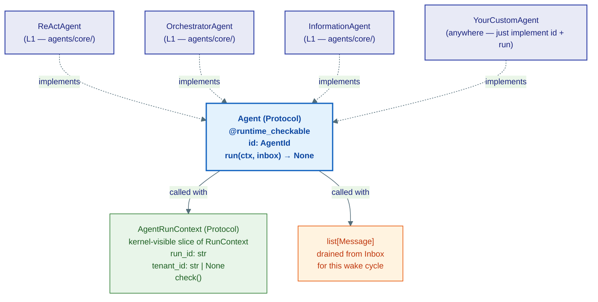
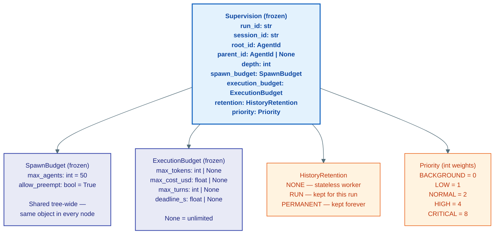
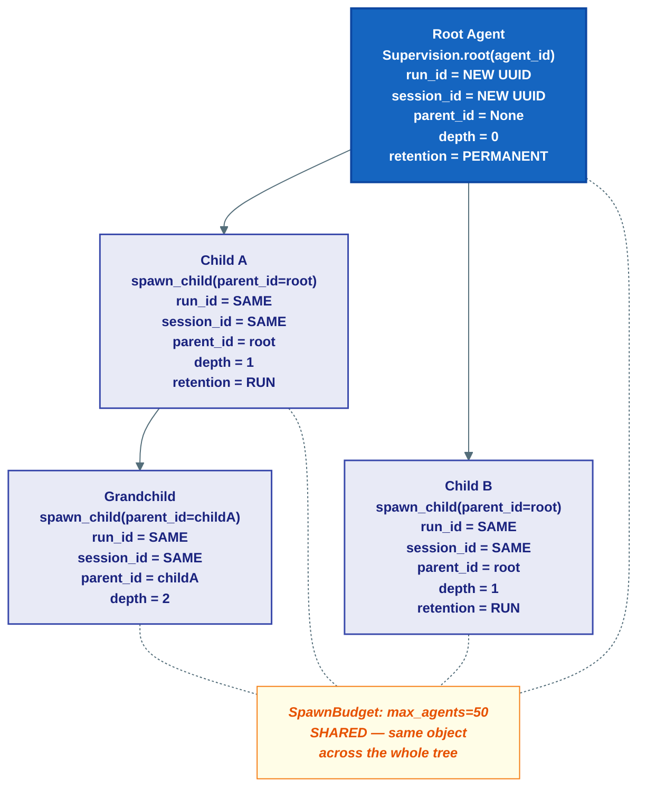
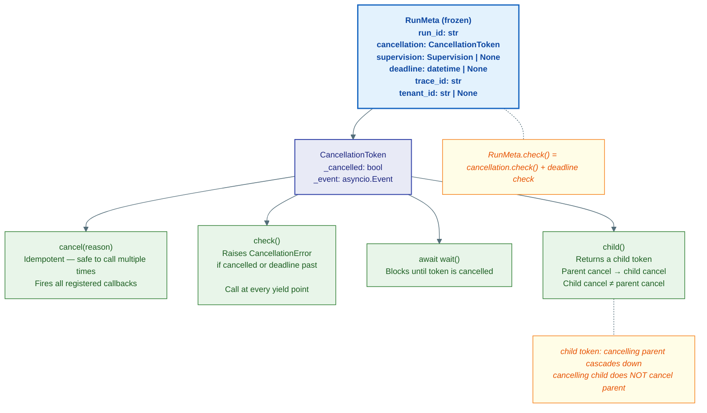
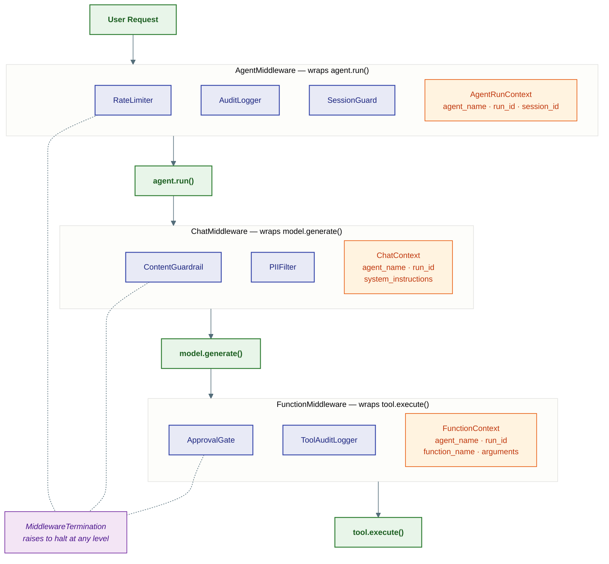
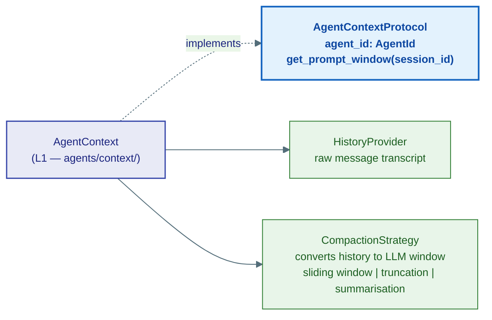

# agent/ — What an Agent IS

> **Source:** `kernel/agent/context.py` · `kernel/agent/middleware.py` · `kernel/agent/runtime_context.py` · `kernel/agent/supervision.py` · `kernel/runtime/agent.py`

Defines the `Agent` Protocol, the supervision tree that governs it, the execution context threaded through every call, and the three-level middleware chain that wraps every operation.

---

## The Agent Protocol

The simplest possible contract — just an identity and an entry point:



`AgentRunContext` is the **kernel-visible slice** only. At runtime, `ctx` is actually a `RunContext` from L1, which adds all the journaled methods: `ctx.llm()`, `ctx.tool()`, `ctx.spawn()`, `ctx.join()`, `ctx.emit()`, `ctx.sleep_until()`. Type-hint with `RunContext` in your agent code for full IDE support.

---

## Supervision — The Agent Org-Chart

When an orchestrator spawns a sub-agent, it passes `Supervision` — the child's formal position in the execution tree.



### How it propagates down the tree



`session_id` and `run_id` serve different scopes:
- `session_id` — the conversation thread. Long-lived, many runs. **History is keyed by this.**
- `run_id` — one execution tree. Short-lived, one `run()` call. **Budget, supervision, and progress topic are keyed by this.**

---

## RunMeta and CancellationToken

Threaded through every kernel API call — LLM calls, tool executions, storage reads. Lets any operation be cancelled cooperatively without global state.



`RunMeta` is immutable. Thread it down call stacks. For child spans: create a new `RunMeta` with a child token (cancellation propagates) and a new trace span.

---

## Three-Level Middleware Pipeline

Every operation passes through three nested interceptor chains — one per level of the agent loop.



All three levels share one Protocol shape:

```python
class Middleware(Protocol[CtxT]):
    async def process(self, context: CtxT,
                      call_next: Callable[[], Awaitable[None]]) -> None: ...
```

Call `call_next()` to continue; raise `MiddlewareTermination` to halt. The concrete `MiddlewarePipeline` at L1 chains registered instances.

---

## AgentContextProtocol — What the Loop Reads



`get_prompt_window(session_id)` is the only thing the agent loop calls on context. Internally it calls the `HistoryProvider` to get the transcript and the `CompactionStrategy` to reduce it to a manageable LLM context window.
