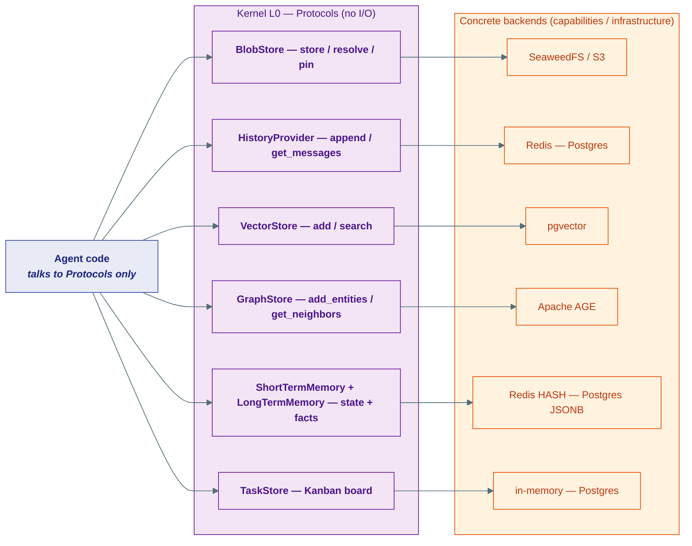
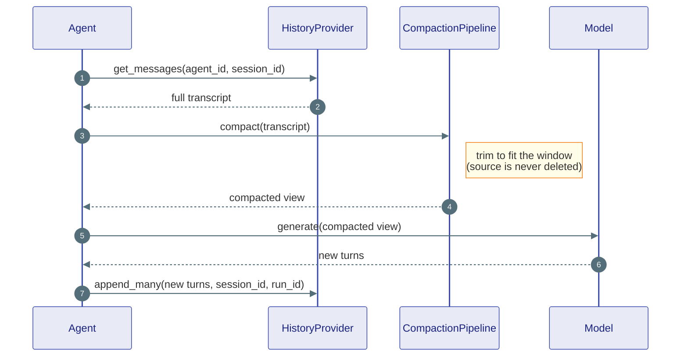
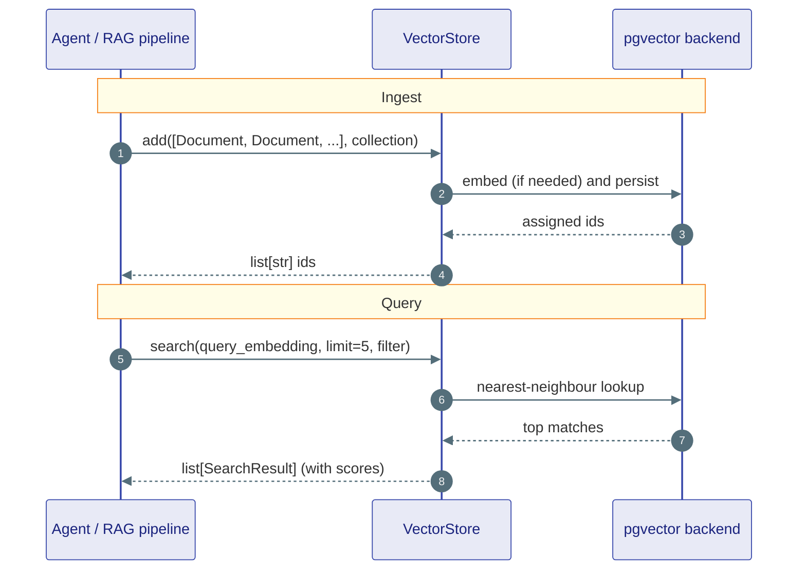
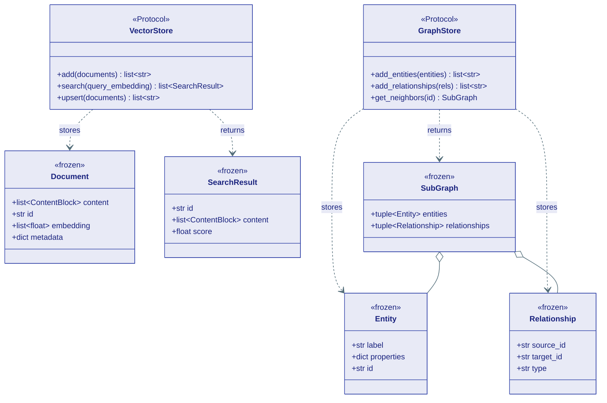

# Storage Contracts

## What this is

An agent needs to *keep* things: the big PDF a user uploaded, the back-and-forth
of a conversation, a pile of documents it can search by meaning, a web of facts
about who-knows-whom, the little notes it jotted during a chat, and its own
to-do list. None of that should live inside the agent's code — it should live in
a **store**, and the agent should be able to ask for it without caring *where*
the bytes actually sit.

The kernel (layer L0) defines that "asking shape" — and nothing more. Every
store on this page is a **Protocol**: a list of `async def` method signatures
with no body. The kernel never opens a socket, never touches a disk. It only
says *"a vector store must have an `add` and a `search`"*. The real work —
talking to Postgres, Redis, pgvector, Apache AGE, SeaweedFS — happens in concrete
backends up in `capabilities/` and `infrastructure/`.

!!! note "Why Protocols instead of classes?"
    A Protocol is a *promise about shape*, not an implementation. Any object
    that has the right methods satisfies it — no inheritance required. This is
    the whole trick that lets you run an in-memory dict in tests and a Postgres
    cluster in production **without changing a single line of agent code**. Swap
    the backend, keep the contract.

This page walks through six filing cabinets, each with its own analogy:

| Cabinet | Protocol | Analogy |
|---|---|---|
| Big binary blobs | `BlobStore` | a **locker** for oversized boxes |
| Conversation transcript | `HistoryProvider` | a **diary** of everything said |
| Semantic search | `VectorStore` | a **librarian** who finds books by meaning |
| Knowledge graph | `GraphStore` | a detective's **pinboard** of who-knows-whom |
| Session + cross-session memory | `ShortTermMemory` / `LongTermMemory` | a desk's **sticky notes** and **rolodex** |
| Per-agent to-do board | `TaskStore` | a **Kanban board** on the wall |



!!! tip "One mental model for all six"
    Read down the diagram: agent talks to a **Protocol**, the Protocol is
    satisfied by an interchangeable **backend**. Learn that pattern once and all
    six stores feel the same.

---

## 1. BlobStore — the locker for big boxes

**Plain English:** a `BlobStore` keeps large binary things — an image, a PDF, a
generated audio clip, an intermediate result too big to pass around inline. You
hand it bytes, it hands you back a short opaque *ref* string. Later you trade the
ref back for the bytes.

**Analogy:** a coin locker at a train station. You put your heavy suitcase in,
you get a small numbered token. You don't carry the suitcase around — you carry
the token. `pin` is paying extra so the locker doesn't auto-clear your suitcase
overnight.

```python
class BlobStore(Protocol):
    async def store(self, data: bytes | str, *,
                    content_type: str = "application/octet-stream") -> str: ...
    async def resolve(self, ref: str) -> bytes: ...
    async def pin(self, ref: str) -> None: ...    # survive past default expiry
    async def unpin(self, ref: str) -> None: ...  # release back to expiry
```

!!! warning "Pin your intermediates in long chains"
    Refs expire by default. A long-running tool chain that stashes an
    intermediate and reads it back minutes later must `pin` it first — otherwise
    the locker may clear it mid-execution and `resolve` will fail.

**Example backends:** an in-memory `dict` for dev, a SeaweedFS / S3 adapter for
production.

---

## 2. HistoryProvider — the diary

**Plain English:** a `HistoryProvider` is durable storage for an agent's
conversation transcript — the ordered list of `ChatMessage` turns. It only reads
and writes; it never summarises or trims (that is the compaction pipeline's job,
covered in [Memory & Context](../concepts/memory.md)).

**Analogy:** a diary. You only ever *append* a new entry to the bottom, and you
read it back front-to-back. You never rewrite yesterday.

Everything is keyed by **`session_id`** — the long-lived conversation thread, so
two users' chats never bleed together. Each message is *also* tagged with a
**`run_id`** — one execution of `run()` — so a single run's messages can be
wiped without destroying the rest of the thread.

```python
class HistoryProvider(Protocol):
    async def append(self, agent_id: AgentId, message: ChatMessage, *,
                     session_id: str, run_id: str = "") -> None: ...
    async def append_many(self, agent_id: AgentId, messages: list[ChatMessage], *,
                          session_id: str, run_id: str = "") -> None: ...
    async def get_messages(self, agent_id: AgentId, *, session_id: str,
                           limit: int | None = None,
                           offset: int | None = None) -> list[ChatMessage]: ...
    async def clear(self, agent_id: AgentId, *, session_id: str) -> None: ...
    async def clear_run(self, agent_id: AgentId, *, session_id: str,
                        run_id: str) -> None: ...
    async def count_messages(self, agent_id: AgentId, *, session_id: str) -> int: ...
```

!!! note "session vs run"
    `session_id` is the **thread** (long-lived, many runs). `run_id` is **one
    `run()` call** (short-lived). `clear_run` powers `HistoryRetention.RUN`:
    after a throwaway sub-agent finishes, only *its* turns are deleted, leaving
    the session's cross-run context intact.

Here is the read → compact → write cycle that happens around every model call
(compaction itself lives one layer up, in `agents/`):



**Example backends:** `InMemoryHistoryProvider` (dev), `RedisHistoryProvider`
(fast, TTL'd), `DurableHistoryProvider` (durable, queryable).

---

## 3. VectorStore — the librarian who finds books by meaning

**Plain English:** a `VectorStore` holds chunks of content as `Document`s and
lets you find the ones *closest in meaning* to a query — not by keyword match,
but by similarity of their numeric **embeddings**. This is the engine under
Retrieval-Augmented Generation (RAG).

**Analogy:** a librarian who has read every book. You don't give them a call
number — you describe what you're after ("something about avoiding double
charges in distributed systems") and they hand you the three closest books, each
with a *how-close* score.

Three value types travel together:

- **`Document`** — what you store. A list of `ContentBlock`s (text, image,
  audio — multimodal), an `id`, an optional pre-computed `embedding`, and free
  `metadata`. Use `Document.from_text("...")` for the plain-text common case.
- **`SearchResult`** — what a search returns. Mirrors `Document` but adds a
  `score` (how relevant).
- **`VectorStore`** — the Protocol that ties them together.

```python
@dataclass(frozen=True)
class Document:
    content: list[ContentBlock]
    id: str
    embedding: list[float] | None   # None → store computes it
    metadata: dict[str, Any]

@dataclass(frozen=True)
class SearchResult:
    id: str
    content: list[ContentBlock]
    score: float                    # relevance, higher = closer
    metadata: dict[str, Any]

class VectorStore(Protocol):
    async def add(self, documents: list[Document], *,
                  collection: str = "default") -> list[str]: ...
    async def search(self, query_embedding: list[float], *,
                     collection: str = "default", limit: int = 5,
                     filter: dict[str, Any] | None = None) -> list[SearchResult]: ...
    async def get(self, ids: list[str], *, collection: str = "default") -> list[Document]: ...
    async def upsert(self, documents: list[Document], *,
                     collection: str = "default") -> list[str]: ...
    async def delete(self, ids: list[str], *, collection: str = "default") -> int: ...
    async def list_collections(self) -> list[str]: ...
    async def delete_collection(self, collection: str) -> int: ...
```

!!! tip "Embeddings are optional on the way in"
    If `Document.embedding` is `None`, the store is responsible for computing it
    (server-side embedding, or a wired-in embedding client). Pass a pre-computed
    vector when you already have one.

The add → search cycle:



!!! note "`Document` is not `DocumentBlock`"
    A `VectorStore` `Document` is a *RAG chunk*. A `DocumentBlock` (from
    `kernel/core/content.py`) is *message content* sent to a model. Same word,
    different job — never conflate them.

**Example backends:** an in-memory store for dev, `PgVectorStore` (pgvector) for
production. See [Vector Memory](../concepts/vector-memory.md).

---

## 4. GraphStore — the detective's pinboard

**Plain English:** a `GraphStore` holds a **knowledge graph** — facts as nodes
(`Entity`) connected by labelled edges (`Relationship`) — and lets you walk
outward from any node to its neighbours.

**Analogy:** a detective's pinboard. Photos are entities ("Alice", "Project X"),
strings of yarn are relationships ("Alice → *works_on* → Project X"). Ask "who's
two hops from Alice?" and you pull the connected cluster — a `SubGraph`.

Three frozen value types plus the Protocol:

- **`Entity`** — a node: a `label`, free `properties`, an `id`.
- **`Relationship`** — an edge: `source_id`, `target_id`, a `type`, free
  `properties`, an `id`.
- **`SubGraph`** — a query result: a tuple of entities and a tuple of
  relationships.

```python
@dataclass(frozen=True)
class Entity:
    label: str
    properties: dict[str, Any]
    id: str

@dataclass(frozen=True)
class Relationship:
    source_id: str
    target_id: str
    type: str
    properties: dict[str, Any]
    id: str

@dataclass(frozen=True)
class SubGraph:
    entities: tuple[Entity, ...]
    relationships: tuple[Relationship, ...]

@runtime_checkable
class GraphStore(Protocol):
    async def add_entities(self, entities: list[Entity]) -> list[str]: ...
    async def add_relationships(self, relationships: list[Relationship]) -> list[str]: ...
    async def get_neighbors(self, entity_id: str, *, depth: int = 1,
                            relationship_types: list[str] | None = None) -> SubGraph: ...
    async def delete_entity(self, entity_id: str) -> bool: ...
    async def delete_relationship(self, relationship_id: str) -> bool: ...
```

!!! note "Cypher is an optional bolt-on"
    The core `GraphStore` is query-language-agnostic. Backends that speak Cypher
    (Neo4j, Apache AGE) *also* implement the separate `CypherCapable` Protocol
    with `query_cypher(...)`. Check at runtime with
    `isinstance(store, CypherCapable)` before issuing raw Cypher.



**Example backends:** an in-memory graph for dev, `AGEGraphStore` (Apache AGE)
for production. See [Graph Memory](../concepts/graph-memory.md).

---

## 5. Memory — sticky notes and the rolodex

`memory.py` defines **two** memory scopes plus a small `Memory` result type.
They sit *alongside* `HistoryProvider` (the raw transcript), capturing distilled
*facts* rather than the full word-for-word log.

**`ShortTermMemory`** — key-value state that lives as long as one session.

> **Analogy:** sticky notes on your desk during one work session — "user wants
> dark mode", "cart has 3 items". Cleared when the session ends.

**`LongTermMemory`** — extracted facts that persist across sessions, forever.

> **Analogy:** your rolodex — "User's name is Alice", "prefers Python". You still
> have it next year. Scoped by `(namespace, agent_id)` so one tenant's facts
> never leak into another's.

```python
@dataclass(frozen=True)
class Memory:
    content: str               # the fact text
    score: float               # relevance to the query (0–1)
    id: str
    metadata: dict[str, Any]

class ShortTermMemory(Protocol):
    async def get_state(self, session_id: str) -> dict[str, Any]: ...
    async def set_state(self, session_id: str, state: dict[str, Any]) -> None: ...
    async def update_state(self, session_id: str, patch: dict[str, Any]) -> None: ...
    async def clear(self, session_id: str) -> None: ...

class LongTermMemory(Protocol):
    async def save(self, agent_id: AgentId, content: str, *,
                   namespace: str = "default",
                   metadata: dict[str, Any] | None = None,
                   ttl_seconds: int | None = None) -> str: ...
    async def search(self, agent_id: AgentId, query: str, *,
                     namespace: str = "default", limit: int = 10) -> list[Memory]: ...
    async def get(self, agent_id: AgentId, memory_id: str, *,
                  namespace: str = "default") -> Memory | None: ...
    async def delete(self, agent_id: AgentId, memory_id: str, *,
                     namespace: str = "default") -> bool: ...
    async def clear(self, agent_id: AgentId, *, namespace: str = "default") -> None: ...
```

!!! warning "Mutate `ShortTermMemory` with `update_state`, not get+set"
    `update_state` merges a patch atomically (Redis `HSET` of the changed keys,
    Postgres `jsonb_set`). Use `get_state` + `set_state` only for full
    replacement (onboarding, reset) — get+set racing under concurrency will lose
    writes.

**Example backends:** `ShortTermMemory` → in-memory dict / Redis HASH / Postgres
JSONB. `LongTermMemory` → Postgres full-text, a vector store (semantic), a graph
store (relationships), or a hybrid.

---

## 6. TaskStore — the Kanban board on the wall

**Plain English:** a `TaskStore` is durable storage for per-agent to-do boards.
Each board is a `TaskList` of `Task`s, scoped by `conversation_id`, where every
task moves through a fixed 6-state lifecycle.

**Analogy:** a Kanban board on the wall. Cards (`Task`) slide between columns;
each agent in a conversation gets its own board, and sub-agents get their own
boards too.

```python
class TaskStatus(StrEnum):
    PLANNED = "planned"
    IN_PROGRESS = "in_progress"
    BLOCKED = "blocked"
    SUCCEEDED = "succeeded"     # terminal
    FAILED = "failed"
    ABANDONED = "abandoned"     # terminal (retries exhausted)

@dataclass(frozen=True)
class Task:
    id: str
    title: str
    status: TaskStatus = TaskStatus.PLANNED
    order: int = 0
    retry_count: int = 0
    note: str = ""

@dataclass(frozen=True)
class TaskList:           # one agent's board within a conversation
    id: str
    conversation_id: str
    tasks: list[Task]
    max_retries: int = 3
    agent_id: str = ""
    agent_label: str = ""
    parent_agent_id: str | None = None
```

The `TaskStore` Protocol covers the board's whole lifecycle — create, fetch (by
id or conversation), append tasks, update status, rename, delete, and two
retry paths:

```python
class TaskStore(Protocol):
    async def create_task_list(self, conversation_id: str, task_titles: list[str], *,
                               agent_id: str = "", agent_label: str = "",
                               parent_agent_id: str | None = None,
                               max_retries: int = 3) -> TaskList: ...
    async def get_task_list(self, task_list_id: str) -> TaskList | None: ...
    async def get_by_conversation(self, conversation_id: str) -> TaskList | None: ...
    async def get_boards_by_conversation(self, conversation_id: str) -> list[TaskList]: ...
    async def update_status(self, task_list_id: str, task_id: str,
                            status: TaskStatus | str, note: str = "") -> Task | None: ...
    async def add_tasks(self, task_list_id: str, titles: list[str]) -> list[Task]: ...
    async def delete_task(self, task_list_id: str, task_id: str) -> bool: ...
    async def increment_retry(self, task_list_id: str, task_id: str) -> Task | None: ...
    async def force_retry(self, task_list_id: str, task_id: str) -> Task | None: ...
    async def update_task_title(self, task_list_id: str, task_id: str, title: str) -> Task | None: ...
```

!!! note "Two kinds of retry"
    `increment_retry` is the *agent's* retry — it bumps `retry_count` and returns
    `None` once `max_retries` is hit (the caller then marks the task
    `abandoned`). `force_retry` is the *human* override — it resets the count to
    0 and revives even an `abandoned` task.

**Example backends:** today the `TaskStore` ships in-memory (in `agents/storage/`),
with a Postgres-backed implementation tracked as planned tech debt.

---

## Summary

| Protocol | What it stores | Keyed by | Example backend |
|---|---|---|---|
| `BlobStore` | Large binary artifacts (files, media, intermediates) | opaque `ref` | in-memory → SeaweedFS / S3 |
| `HistoryProvider` | Ordered `ChatMessage` transcript | `session_id` (+ `run_id`) | in-memory → Redis / Postgres |
| `VectorStore` | `Document` chunks for semantic search | `id` within a `collection` | in-memory → pgvector |
| `GraphStore` | `Entity` nodes + `Relationship` edges | `entity_id` / `relationship_id` | in-memory → Apache AGE |
| `ShortTermMemory` | Key-value session state (facts learned this session) | `session_id` | in-memory dict / Redis HASH / Postgres JSONB |
| `LongTermMemory` | Cross-session facts, retained forever | `(namespace, agent_id)` | Postgres full-text / vector / graph / hybrid |
| `TaskStore` | Per-agent Kanban boards (`TaskList` of `Task`) | `conversation_id` / `agent_id` | in-memory (Postgres planned) |

!!! tip "The one rule to remember"
    Agent code imports the **Protocol** from the kernel. The lifespan wires in
    whichever **backend** is appropriate. That separation is why the same agent
    runs unchanged in a unit test and in a Postgres + Redis + SeaweedFS production
    cluster.

---

## Where this lives

| Piece | Location |
|---|---|
| `BlobStore` Protocol | `kernel/storage/blob.py` |
| `HistoryProvider` Protocol | `kernel/storage/history.py` |
| `VectorStore`, `Document`, `SearchResult` | `kernel/storage/vector.py` |
| `GraphStore`, `Entity`, `Relationship`, `SubGraph`, `CypherCapable` | `kernel/storage/graph.py` |
| `Memory`, `ShortTermMemory`, `LongTermMemory` | `kernel/storage/memory.py` |
| `TaskStatus`, `Task`, `TaskList`, `TaskStore` | `kernel/storage/tasks.py` |
| `ChatMessage`, `ContentBlock` (payload types) | `kernel/core/content.py` |
| `AgentId` (history / memory keys) | `kernel/core/identity.py` |
| History backends | `agents/context/history.py`, `capabilities/history/` |
| Vector / graph backends | `capabilities/vector/`, `capabilities/graph/` |
| Blob / memory / task backends | `capabilities/storage/`, `capabilities/memory/`, `agents/storage/` |

**Next:** [Agent Policy: Context, Middleware, Supervision](06-agent.md) — the
contracts that decide *how* an agent assembles context, intercepts its own
steps, and bounds the sub-agents it spawns.
