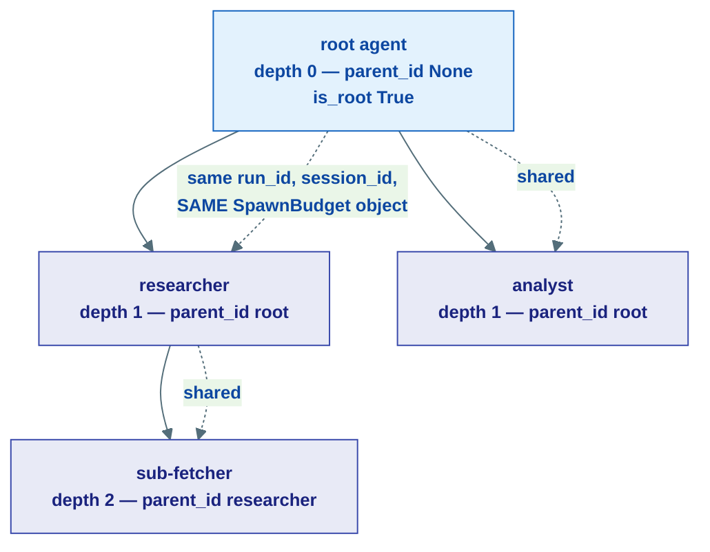
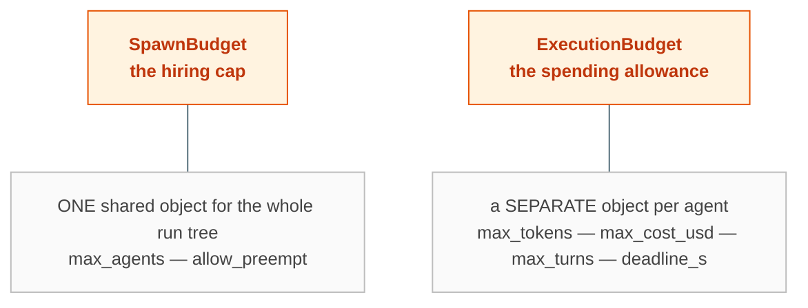
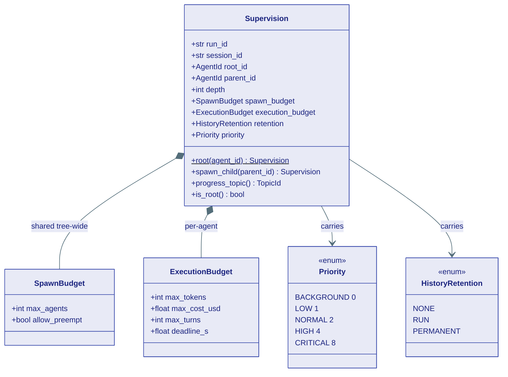
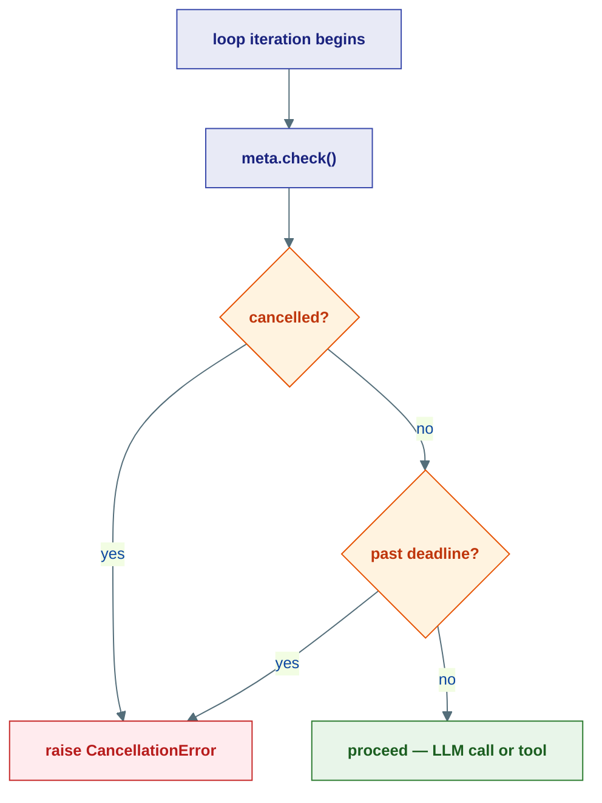
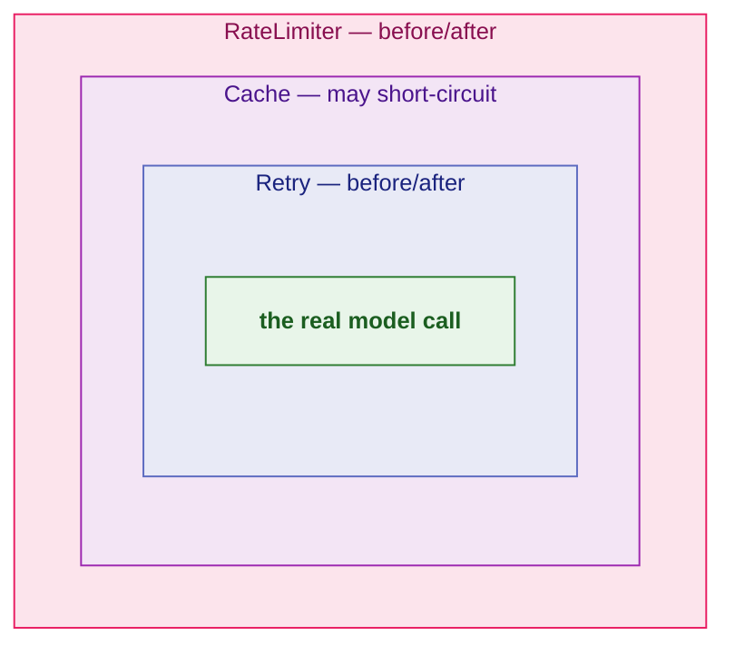

# Agent Policy: Supervision, Context, Middleware

## What this is

An agent that can spawn other agents, run for minutes, and burn real money
needs **rules** wrapped around it: who it reports to, how many helpers the whole
job may hire, how much each helper is allowed to spend, when to give up, and what
to do *around* every model call. None of those rules are the agent's *reasoning*
— they are **policy**. The kernel (layer L0) defines that policy as frozen
contracts: a handful of dataclasses, two enums, and three Protocols, with zero
I/O.

Think of one agent run as a **small company spun up to finish one project**:

| Real-world thing | Kernel type |
|---|---|
| Your spot in the org chart (who's your manager, what project) | `Supervision` |
| Company-wide hiring cap ("no more than 50 people on this project") | `SpawnBudget` |
| Each employee's spending allowance (tokens, dollars, hours) | `ExecutionBudget` |
| How important your branch of work is | `Priority` |
| Whether your notes are shredded, kept for the project, or filed forever | `HistoryRetention` |
| The clerk who trims a fat email thread before you read it | `CompactionStrategy` |
| Your employee ID badge with a shift deadline | `RunMeta` |
| Airport-style security layers wrapping every model call | `Middleware` |

!!! note "This is the contract-level companion to two higher-level pages"
    For the *story* of how these are enforced at runtime — the `SpawnTracker`,
    the `ExecutionTracker`, the `MiddlewarePipeline` — read
    [Supervision & Budgets](../concepts/supervision.md) and
    [Middleware](../concepts/middleware.md). This page stays inside
    `kernel/agent/` and documents only the frozen types. Everything that
    actually *tracks* a budget or *runs* a pipeline lives one layer up, in
    `agents/`.

The kernel ships four small files, and we cover each:

1. **`supervision.py`** — the org chart (`Supervision`) and the two budgets.
2. **`runtime_context.py`** — the ID badge with a deadline (`RunMeta`) and the
   stop button (`CancellationToken`).
3. **`context.py`** — how an agent's prompt window is assembled
   (`AgentContextProtocol`, `CompactionStrategy`).
4. **`middleware.py`** — the interceptor contract (`Middleware`).

---

## Supervision — the org chart

A **`Supervision`** node is one agent's formal position in an execution
hierarchy: who its manager is, which project (run) and conversation (session)
it belongs to, what level it sits at, and what resource limits the project
operates under. The same policy is passed *top-down* when spawning children, so
every agent in the tree shares the same identifiers and the same hiring cap.

```python
@dataclass(frozen=True, slots=True)
class Supervision:
    run_id: str                       # one execution tree (one run() call)
    session_id: str                   # one conversation thread (many runs)
    root_id: AgentId                  # the top of this tree
    parent_id: AgentId | None         # your manager (None at the root)
    depth: int = 0                    # informational only — UI nesting
    spawn_budget: SpawnBudget = ...        # shared across the WHOLE tree
    execution_budget: ExecutionBudget = ...# per-agent resource limits
    retention: HistoryRetention = HistoryRetention.RUN
    priority: Priority = Priority.NORMAL
```

Two of those fields are IDs that are easy to confuse, so pin them down on first
use:

- **`session_id`** — the *conversation thread*. Long-lived; one session spans
  many runs. **History is always keyed by `session_id`.**
- **`run_id`** — *one execution tree*, the result of a single `run()` call.
  Short-lived. It scopes the budget, the supervision tree, resume/replay, and
  the progress pub/sub topic.



### Building the tree: `root()` then `spawn_child()`

You never hand-build a `Supervision`. You call `Supervision.root()` once on the
top-level agent, then thread the result into every child via `spawn_child()`.

```python
# Called ONCE on the user-facing agent — mints a fresh run_id.
sup = Supervision.root(
    agent_id,
    session_id=None,            # None → fresh uuid; pass an id to resume a session
    spawn_budget=None,          # None → SpawnBudget() (50 agents, preempt on)
    execution_budget=None,      # None → ExecutionBudget() (all unlimited)
    retention=HistoryRetention.PERMANENT,   # default for the root
    priority=Priority.NORMAL,
)

# Called by a parent for each helper it hires.
child_sup = sup.spawn_child(
    parent_id=sup.root_id,
    retention=HistoryRetention.RUN,         # default for children
    priority=Priority.HIGH,
    execution_budget=None,      # None → inherit the parent's budget
)
```

A child created by `spawn_child()` inherits:

- the **same `run_id`** (one execution tree) and **`session_id`** (one
  conversation),
- the **same `SpawnBudget` *instance*** — so the headcount cap is global to the
  tree, not per-branch,
- the parent's `execution_budget` by default (pass an override to give a child
  *tighter* limits),
- `depth + 1` — purely informational for UI indentation. **There is no depth
  limit;** `SpawnBudget` is the single structural constraint.

!!! tip "Two handy accessors"
    - **`sup.is_root`** → `True` when `parent_id is None`.
    - **`sup.progress_topic`** → `TopicId("agent.progress", run_id)`. *Every*
      agent in the run publishes progress to this one topic, so a UI subscribes
      once and watches the entire tree.

!!! warning "`Supervision` is frozen"
    Every supervision type on this page is `frozen=True`. You do not mutate a
    node to add a child — you derive a *new* node with `spawn_child()`. The
    mutable counters that actually enforce the budgets live one layer up, in the
    `agents/` trackers.

---

## Two orthogonal budgets

Agent Substrate deliberately separates **"how many agents may exist"** from **"how much
each agent may spend."** They are different questions enforced by different
trackers, so they live in two different dataclasses.



| Budget | Scope | Fields | Default | A field of `None` means |
|---|---|---|---|---|
| `SpawnBudget` | **Run-wide** — one shared instance for the entire tree | `max_agents`, `allow_preempt` | `max_agents=50`, `allow_preempt=True` | (no nullable fields) |
| `ExecutionBudget` | **Per-agent** — each agent carries its own | `max_tokens`, `max_cost_usd`, `max_turns`, `deadline_s` | all `None` (unlimited) | unlimited for *that one* dimension |

### `SpawnBudget` — the hiring cap

```python
@dataclass(frozen=True, slots=True)
class SpawnBudget:
    max_agents: int = 50        # total agents allowed in the run (root counts as 1)
    allow_preempt: bool = True  # may HIGH/CRITICAL agents pause lower ones for a slot?
```

It is a *project-wide* limit. The same `SpawnBudget` object is propagated to
every node, so a fork bomb is impossible: when the count hits `max_agents`, no
branch can hire. If `allow_preempt` is on, an important agent that needs a slot
can cooperatively **pause** a lower-priority one to claim it instead of being
denied outright (the full preemption flow lives in the
[Supervision concept page](../concepts/supervision.md)).

### `ExecutionBudget` — the per-employee allowance

```python
@dataclass(frozen=True, slots=True)
class ExecutionBudget:
    max_tokens: int | None = None     # total LLM tokens (prompt + completion)
    max_cost_usd: float | None = None # cumulative LLM spend in USD
    max_turns: int | None = None      # LLM round-trips (one tool call = one turn)
    deadline_s: float | None = None   # wall-clock seconds from run start
```

This is *one employee's allowance*. Each agent gets its own. The `agents/`-layer
`ExecutionTracker` counts real consumption against it and raises
`BudgetExhaustedError` the instant any limit is breached. The `deadline_s`
dimension is the only one enforced at the kernel boundary — by the deadline on
`RunMeta` (next section).

---

## Priority and HistoryRetention — two small enums

### `Priority` — how important this branch is

An integer weight used for proportional pool allocation and to decide who gets
preempted. A `CRITICAL` agent gets 8x the default share; `BACKGROUND` is
best-effort.

```python
class Priority(int, Enum):
    BACKGROUND = 0
    LOW = 1
    NORMAL = 2     # default
    HIGH = 4
    CRITICAL = 8
```

| Priority | Weight | Plain English |
|---|---|---|
| `BACKGROUND` | 0 | best-effort, first to be paused |
| `LOW` | 1 | nice-to-have |
| `NORMAL` | 2 | the default lane |
| `HIGH` | 4 | jump the queue, can preempt lower lanes |
| `CRITICAL` | 8 | top of the food chain |

### `HistoryRetention` — how long the notes survive

How long an agent's conversation history is kept after the run ends.

```python
class HistoryRetention(str, Enum):
    NONE = "none"          # stateless worker — nothing persisted
    RUN = "run"            # kept for this run (scoped by run_id), then deleted
    PERMANENT = "permanent"# kept forever — for top-level user-facing agents
```

| Policy | Lifetime | Use it for |
|---|---|---|
| `NONE` | not persisted at all | a throwaway stateless sub-task |
| `RUN` | scoped to `run_id`, deleted after the run | most spawned helpers (the `spawn_child()` default) |
| `PERMANENT` | kept forever | the top-level, user-facing agent (the `root()` default) |

---

## The supervision classes at a glance



---

## `RunMeta` — the ID badge with a shift deadline

Where `Supervision` is the *org chart*, **`RunMeta`** is the **employee ID
badge** carried into every kernel call: it says which run you're on, lets anyone
hit a **stop button**, names your **shift deadline**, and carries the tracing and
tenant tags so observability and multi-tenant scoping work without adding a
parameter to every function.

```python
@dataclass(frozen=True, slots=True)
class RunMeta:
    run_id: str                          # globally unique id for this run
    cancellation: CancellationToken      # the cooperative stop button
    supervision: Supervision | None = None   # org-chart position (None if standalone)
    deadline: datetime | None = None     # wall-clock expiry — agents/tools honour it
    trace_id: str = ...                  # distributed-trace id (auto-generated)
    tenant_id: str | None = None         # tenant namespace (None = single-tenant)
```

`RunMeta` is immutable — you **thread it down** the call stack rather than
mutating it. Two ways to get one:

- `RunMeta.standalone(...)` — a fresh badge with a brand-new
  `CancellationToken`, for a run that has no supervision tree.
- Built per-run by the runtime, where `run_id` is populated from
  `supervision.run_id`.

### The stop button: `CancellationToken`

A `CancellationToken` is a pure-asyncio cooperative cancellation signal — no
threads, no global state. Someone on the outside (an orchestrator, a timeout
handler, the user clicking "stop") calls `token.cancel()`; code on the inside
politely *checks* at safe points.

```python
token.cancel("user stopped")   # from outside — idempotent
token.check()                  # inside: raises CancellationError if cancelled
await token.wait()             # inside: block until cancelled
child = token.child()          # a child token cancelled when this one is
```

### The one method you call in the loop: `meta.check()`

This is how the per-agent `deadline_s` budget and a manual cancel both get
enforced. Call it at every cooperative yield point — before an LLM call, before a
tool runs, between loop iterations:

```python
def check(self) -> None:
    self.cancellation.check()                 # cancelled?  -> CancellationError
    if self.deadline and now() > self.deadline:
        raise CancellationError("deadline exceeded")
```



!!! tip "Deadlines compose with the budget"
    `ExecutionBudget.deadline_s` is *seconds from run start*. The runtime turns
    that into the absolute `RunMeta.deadline`, and `meta.check()` is what
    actually trips it. Same idea, two layers: the kernel states the policy, the
    runtime enforces it.

---

## `CompactionStrategy` and `AgentContextProtocol` — assembling the prompt

A long conversation does not fit in a model's context window, and stuffing the
whole transcript in would be slow and expensive. **`CompactionStrategy`** is the
*clerk who trims the fat email thread before you read it*: it turns the full raw
history into a manageable window. The kernel only fixes the *shape* — the actual
trimming (sliding window, token truncation, LLM summarisation) is an
implementation up in `agents/`.

```python
class CompactionStrategy(Protocol):
    async def compact(self, raw_history: list[ChatMessage]) -> list[ChatMessage]:
        """Return the optimised sequence ready for LLM generation."""
        ...
```

Both input and output are `list[ChatMessage]` — the *same* type
`LLMClient.generate` already consumes, so compaction slots in transparently.

**`AgentContextProtocol`** is the minimal surface the agent loop sees of its own
runtime context. It exposes only two things: the agent's own id, and a way to
get the already-compacted prompt window for a session. Storage details (which
history provider, which compaction strategy) are deliberately *hidden* behind it.

```python
class AgentContextProtocol(Protocol):
    @property
    def agent_id(self) -> AgentId: ...

    async def get_prompt_window(self, session_id: str) -> list[ChatMessage]: ...
```

!!! note "Why so small?"
    The agent loop should not know *how* its history is stored or trimmed — only
    that it can ask for "the messages I should send to the model right now."
    Keeping the Protocol tiny is what lets the storage and compaction internals
    change without touching agent code.

---

## `Middleware` — the airport-security layers

Plenty of things should happen *around* a model call that are not the agent's
reasoning: cache identical requests, retry on a blip, validate the output,
redact PII, log for audit, rate-limit a tenant. **Middleware** pulls each of
those into a composable layer — like the **layered checkpoints at airport
security**: each layer can inspect you on the way in, wave you through to the
next, then inspect you again on the way out.

The kernel defines one interceptor Protocol — not one per level. Every
middleware in the framework, regardless of which of the three moments
(agent-turn, chat, tool) it wraps, implements this exact shape:

```python
class Middleware(Protocol):
    async def process(
        self,
        context: MiddlewareContextProtocol,
        call_next: Callable[[], Awaitable[None]],
    ) -> None: ...
```

The pattern is always: do work *before*, `await call_next()` to go inward, do
work *after* as control unwinds. **Skip `call_next()`** to short-circuit (a cache
hit). **Raise** to abort — typically `MiddlewareTermination` for a guardrail
block.



The kernel also defines `MiddlewareStage` — an enum, not a type parameter —
saying which of the three moments a given context represents:

```python
class MiddlewareStage(str, Enum):
    TURN = "turn"   # one inbox message
    CHAT = "chat"   # one model.generate() call
    TOOL = "tool"   # one tool.execute() call
```

And a **minimal context protocol** describing only the attributes the kernel
itself needs to type-check against, without importing the concrete
`MiddlewareContext` dataclass the `agents/` layer actually constructs:

```python
class MiddlewareContextProtocol(Protocol):
    stage: MiddlewareStage
    agent_name: str
    run_id: str
    metadata: dict[str, Any]
```

That's it — one Protocol, one enum, no per-level type aliases. The concrete
`MiddlewareContext` at the `agents/` layer carries the full set of
stage-specific fields (`messages`, `arguments`, `turn_result`, …); see
[Middleware](../concepts/middleware.md) for that shape and
`agents/core/react.py`/`agents/runtime/context.py` for where each stage is
actually dispatched.

!!! note "Contracts here, behaviour next door"
    This page documents only the *interceptor shape*. The `MiddlewarePipeline`
    that threads layers together, and the built-ins (`Cache`, `Retry`,
    `RateLimiter`, guardrails …), live in `agents/middleware/` — see
    [Middleware](../concepts/middleware.md) for the full onion and the catalogue.

---

## Summary

| Type | Kind | One-liner |
|---|---|---|
| `Supervision` | frozen dataclass | an agent's position in the run tree; threads ids + policy down via `spawn_child()` |
| `SpawnBudget` | frozen dataclass | run-wide headcount cap (`max_agents`, `allow_preempt`) — one shared object |
| `ExecutionBudget` | frozen dataclass | per-agent spend cap (`max_tokens`, `max_cost_usd`, `max_turns`, `deadline_s`) |
| `Priority` | `int` enum | branch weight `BACKGROUND(0)…CRITICAL(8)` for allocation + preemption |
| `HistoryRetention` | `str` enum | `NONE` / `RUN` / `PERMANENT` history lifetime |
| `RunMeta` | frozen dataclass | per-run badge: `run_id`, cancellation, deadline, trace, tenant; `check()` enforces stop + deadline |
| `CancellationToken` | class (pure asyncio) | cooperative stop button: `cancel()`, `check()`, `wait()`, `child()` |
| `CompactionStrategy` | Protocol | trims raw history into a prompt window |
| `AgentContextProtocol` | Protocol | minimal context the loop sees: `agent_id` + `get_prompt_window()` |
| `Middleware` | Protocol | one `process(context, call_next)` interceptor shape, used for all three stages |
| `MiddlewareStage` | `str` enum | `TURN` / `CHAT` / `TOOL` — which moment a `MiddlewareContext` represents |

!!! tip "The one rule to remember"
    The kernel only *states* policy — frozen shapes with no behaviour. The
    `agents/` layer holds the mutable trackers and pipelines that *enforce* it.
    That split is why you can reason about budgets, retention, and cancellation
    as plain data, and swap the enforcement machinery without touching the
    contracts.

---

## Where this lives

| Piece | Location |
|---|---|
| `Supervision`, `SpawnBudget`, `ExecutionBudget`, `Priority`, `HistoryRetention` | `kernel/agent/supervision.py` |
| `RunMeta`, `CancellationToken` | `kernel/agent/runtime_context.py` |
| `CompactionStrategy`, `AgentContextProtocol` | `kernel/agent/context.py` |
| `Middleware`, `MiddlewareStage`, `MiddlewareContextProtocol` | `kernel/agent/middleware.py` |
| `AgentId`, `TopicId` (ids carried by `Supervision`) | `kernel/core/identity.py` |
| `ChatMessage` (compaction payload) | `kernel/core/content.py` |
| `CancellationError`, `BudgetExhaustedError`, `MiddlewareTermination` | `kernel/core/errors.py` |
| `SpawnTracker` (headcount + preemption) | `agents/supervision/budget.py` |
| `ExecutionTracker` (per-agent spend) | `agents/resources/budget.py` |
| `MiddlewarePipeline` + built-in middlewares | `agents/middleware/` |

**Next:** [The Durable Runtime](07-runtime.md) — the contracts that make a run
survivable: the inbox, the scheduler, the event log, and the journal that lets a
crashed run resume without re-paying for what it already did.
