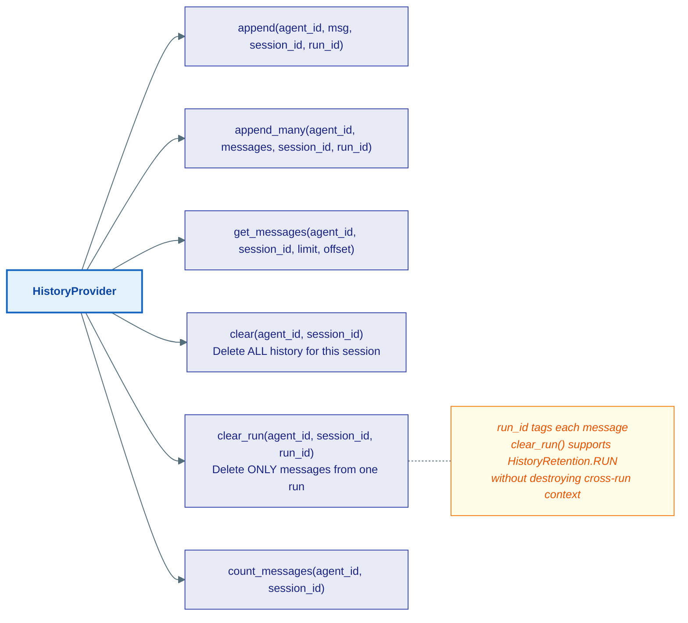
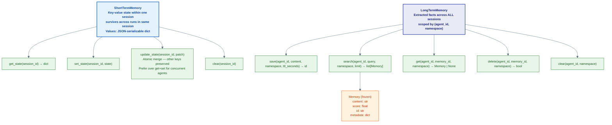
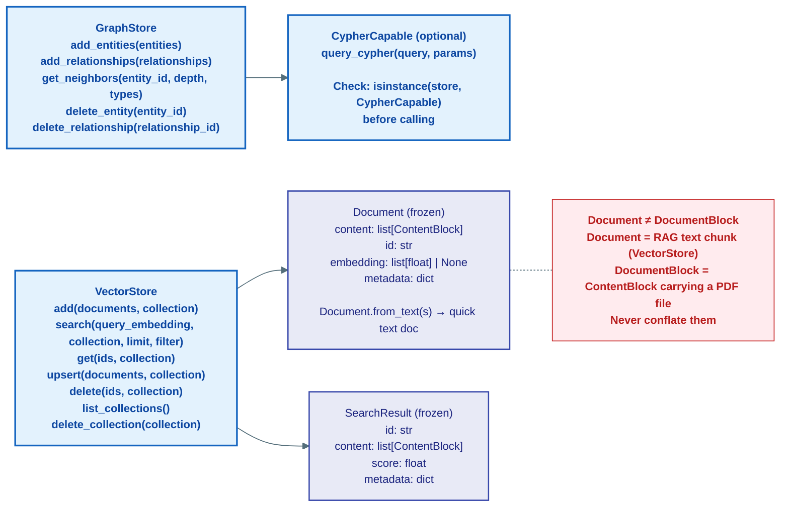
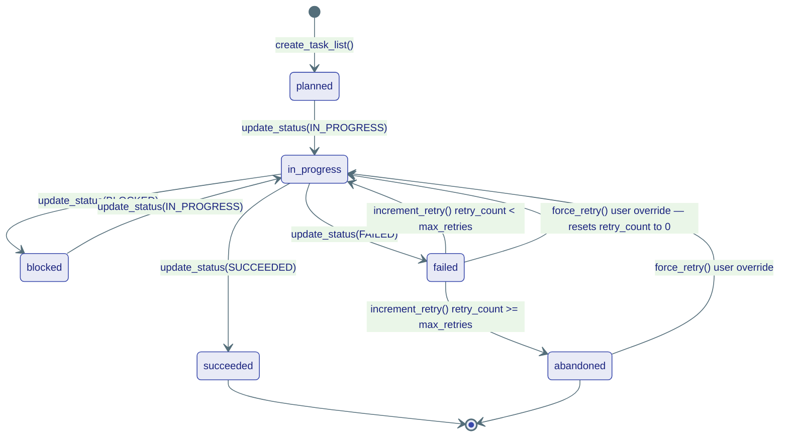

# storage/ — What Agents Remember

> **Source:** `kernel/storage/history.py` · `kernel/storage/memory.py` · `kernel/storage/vector.py` · `kernel/storage/graph.py` · `kernel/storage/blob.py` · `kernel/storage/tasks.py`

Six storage Protocols, each with a specific scope and purpose. All are swappable — in-memory for tests, Postgres/Redis for production — without changing any agent code.

---

## Storage Roles at a Glance

```mermaid
%%{init: {'theme': 'base', 'themeVariables': {'primaryColor': '#E8EAF6','primaryTextColor': '#1A237E','primaryBorderColor': '#3949AB','lineColor': '#546E7A','background': '#FAFAFA','fontSize': '13px'}}}%%
graph TB
    classDef proto fill:#E3F2FD,stroke:#1565C0,stroke-width:2px,color:#0D47A1,font-weight:bold
    classDef impl fill:#FFF3E0,stroke:#E65100,stroke-width:1px,color:#BF360C,stroke-dasharray:4 2
    classDef question fill:#E8F5E9,stroke:#2E7D32,stroke-width:1px,color:#1B5E20,font-style:italic

    HP["HistoryProvider\nWhat was SAID\nOrdered conversation transcript\nkey: (agent_id, session_id)"]:::proto
    STM["ShortTermMemory\nWhat was LEARNED this session\nKey-value session state\nkey: session_id"]:::proto
    LTM["LongTermMemory\nWhat was LEARNED forever\nExtracted cross-session facts\nkey: (agent_id, namespace)"]:::proto
    VS["VectorStore\nSemantic search corpus\nRAG document chunks\nkey: (id, collection)"]:::proto
    GS["GraphStore\nKnowledge graph\nEntities + relationships\nCypher queries optional"]:::proto
    BS["BlobStore\nBinary objects\nS3/MinIO abstraction\npin/unpin TTL control"]:::proto
    TS["TaskStore\nPer-agent Kanban boards\n6-state task lifecycle\nkey: (conversation_id, agent_id)"]:::proto

    IMP1["InMemoryHistoryProvider (L1)\nRedisHistoryProvider (L2)\nPostgresHistoryProvider (L2)"]:::impl
    IMP2["RedisSessionStore (L2)\nPostgresMemoryStore (L2)"]:::impl
    IMP3["RedisSessionStore (L2)\nPgVectorStore for semantic (L2)"]:::impl
    IMP4["PgVectorStore (L2)"]:::impl
    IMP5["AGEGraphStore (L2)"]:::impl
    IMP6["S3FileStore (L2)"]:::impl
    IMP7["TaskStore in-memory (L1)\nPgTaskStore (infrastructure/)"]:::impl

    HP -.-> IMP1
    STM -.-> IMP2
    LTM -.-> IMP3
    VS -.-> IMP4
    GS -.-> IMP5
    BS -.-> IMP6
    TS -.-> IMP7
```

---

## HistoryProvider — Conversation Transcript

The raw ordered log of `ChatMessage` turns. Does not summarize or compact — that's `CompactionStrategy`'s job.

---

## ShortTermMemory vs LongTermMemory

Two distinct memory scopes — session-local vs. permanent across all sessions.

**Three memory types — how they differ:**

| Type | Answers | Scope | Example use |
|---|---|---|---|
| `HistoryProvider` | *What was said?* | Per (agent, session) | Conversation replay, compaction |
| `ShortTermMemory` | *What was learned this session?* | Per session | Cart state, user preferences this session |
| `LongTermMemory` | *What is known permanently?* | Per (agent, namespace) | "User's name is Ravi", "Prefers Python" |

---

## VectorStore and GraphStore — RAG

`Document.content` is `list[ContentBlock]` — RAG documents can contain images, audio, or structured data, not just text. `Document.from_text(s)` is the shortcut for plain-text chunks.

---

## TaskStore — Per-Agent Kanban Board

Task state is a 6-state lifecycle. Both `Task` and `TaskList` are **frozen** — all mutations use `dataclasses.replace()`.

**`TaskList`** groups multiple tasks and tracks `max_retries`. One board per `(conversation_id, agent_id)` pair — sub-agents each get their own board.

**`settle_conversation(conversation_id)`** — flips all `in_progress` tasks to `succeeded` when a run ends normally. Stops the UI Kanban from spinning after the agent finishes.
