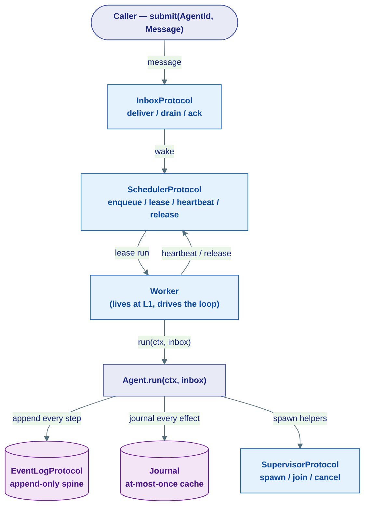
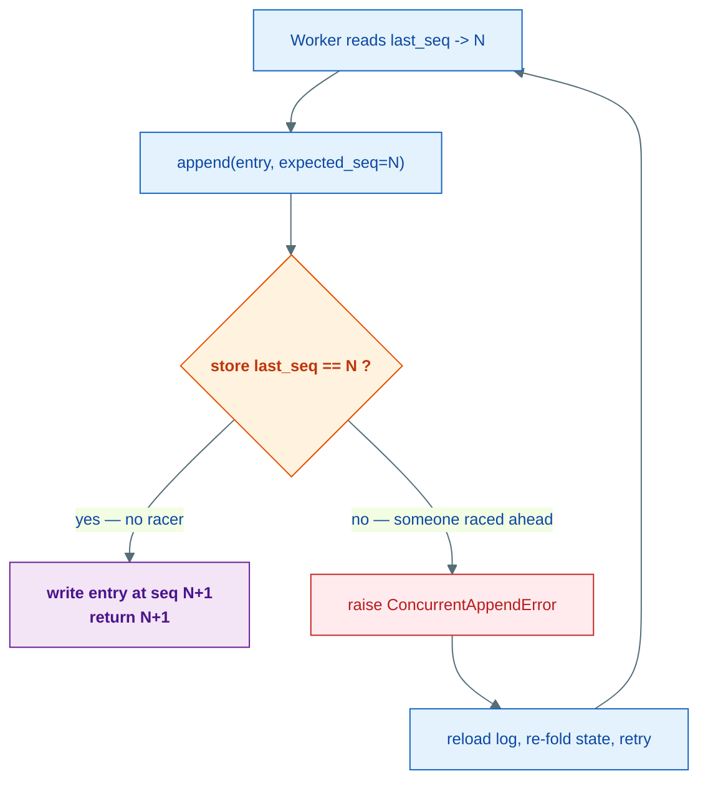
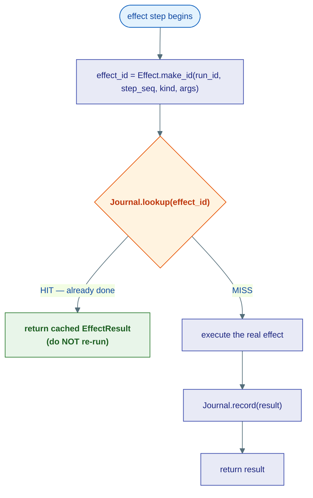
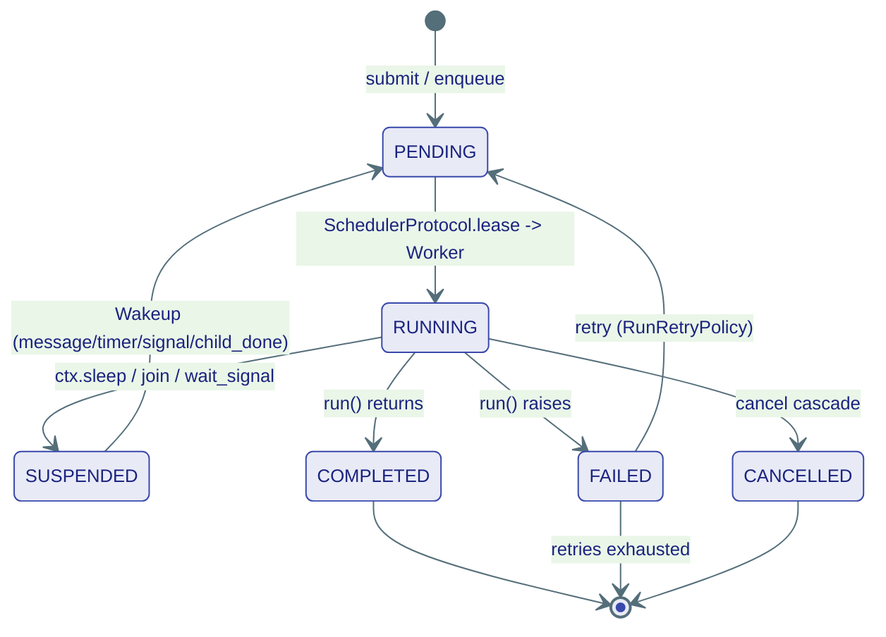
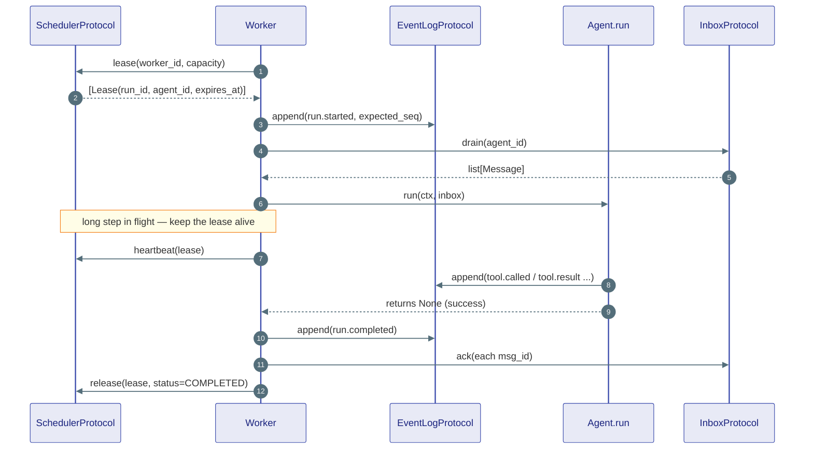
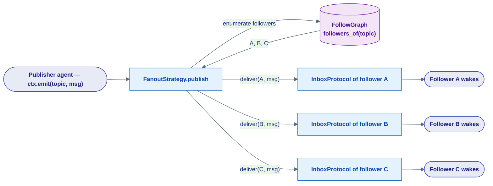

# The Runtime Contracts

## What this is

Every other kernel page describes a *thing an agent can use* — a model client, a
tool, a vector store. **This page describes the machine that runs the agent in
the first place.**

When you submit a message to an agent, something has to: find a free worker,
hand it the job, give it a time-limited claim on it, record every step the agent
takes so a crash can be recovered, make sure a card never gets charged twice,
let the agent spawn helpers and wait for them, deliver newsletters to followers,
and put a sleeping agent back to bed for free until something interesting
happens. That "something" is the **runtime**, and the kernel (layer L0) defines
its shape as a handful of pure **Protocols** and **dataclasses** — no I/O, no
sockets, no database. The real Postgres/Redis/asyncio machinery lives up in
`agents/runtime/` and `infrastructure/runtime/`.

!!! note "This page is the durable engine, seen from below"
    [Durability (concept)](../concepts/durability.md) tells the *story* — what a
    crash looks like, how replay avoids re-charging the card. **This page is the
    contract** — the exact Protocols and fields that make that story possible.
    Read durability first for the "why"; read this for the "what, precisely". We
    cross-link heavily and try not to repeat.

Here is the whole cast, with a one-line analogy for each. The rest of the page
zooms into each one.

| Contract | One-liner | Analogy |
|---|---|---|
| `Agent` | The single thing every agent implements: `id` + `run(ctx, inbox)` | a worker who shows up when called |
| `RunLogEntry` / `EventLogProtocol` | Append-only history of one run | an immutable **ship's logbook** |
| `Effect` / `Journal` | At-most-once cache for side-effects | a **receipts drawer** so you never pay twice |
| `RunId` / `RunStatus` | A run's name and its lifecycle state | a job ticket with a status stamp |
| `InboxProtocol` | Durable per-agent mailbox | a **mailbox** on the porch |
| `SchedulerProtocol` | Work-queue + leasing + admission control | a **dispatcher** handing jobs to drivers on a timer |
| `SupervisorProtocol` | Spawn / join / cancel child runs | a **foreman** who hires and waits on helpers |
| `FollowGraph` / `FanoutStrategy` | Who-follows-whom + delivering posts | a **newsletter** subscription list |
| `Wakeup` / `SignalBusProtocol` | What stirs a sleeping run | a **pager** that wakes a napping worker |
| `AskOutcome` / `RunStatusSummary` | Results of asking another run | a **delivery receipt** with a status code |



!!! tip "The kernel only sees a sliver of `ctx`"
    Agents are written against a rich `RunContext` (L1) with `ctx.llm()`,
    `ctx.tool()`, `ctx.spawn()`, `ctx.emit()`, `ctx.sleep_until_signal()`, and
    more. The kernel deliberately knows only the minimal slice it needs to write
    the contract — `AgentRunContext` below — so it stays frozen and I/O-free.

---

## The Agent Protocol

**What & why:** Every agent in Agent Substrate — a chatbot, an orchestrator, a workflow
node — is *one object that satisfies one Protocol*. There is no base class to
inherit, no lifecycle method soup. Just an `id` (the address) and one async
method `run(ctx, inbox)` that the runtime calls each time the agent wakes.

Think of an agent as a contractor with a business card (`id`) and a single
instruction: *"here's your mail and your toolbox — go."*

```python
class Agent(Protocol):
    id: AgentId

    async def run(self, ctx: AgentRunContext, inbox: list[Message]) -> None: ...
```

- `id` is an `AgentId` (from [`kernel/core/identity.py`](01-core.md)) — a
  stable routing address used by the InboxProtocol and SchedulerProtocol to find this agent.
- `run` is called by the **Worker** with two arguments: the execution context
  `ctx`, and `inbox` — the batch of messages drained for this wake-cycle. The
  batch **may be empty** when the wakeup was a timer, signal, or a child
  finishing rather than a new message.
- It returns `None`. The agent's final output (if any) is written to the
  EventLogProtocol as the `run.completed` entry and surfaced as `RunResult.output`.

You never call `run()` yourself — see [the agent model](../concepts/agent-model.md).
You hold an address and submit a message; the Worker invokes `run` when it leases
the run.

### The kernel's slice of the context

The full `RunContext` lives at L1. The kernel only defines the minimum it needs
to type the contract:

```python
class AgentRunContext(Protocol):
    run_id: str
    tenant_id: str | None

    def check(self) -> None:
        """Raise CancellationError if cancelled or deadline exceeded."""
        ...
```

`ctx.check()` is the **cooperative cancellation point**. An agent in a long loop
calls it between steps so a cancel from a parent (or a deadline) can interrupt it
cleanly — without violating the at-most-once effect guarantee mid-flight.

!!! note "Durability is the baseline, not a feature you opt into"
    The author writes plain async code. Every `ctx.llm()` / `ctx.tool()` /
    `ctx.spawn()` is *journaled* under the hood, so on crash/resume the coroutine
    re-runs from the top but cached calls return instantly instead of
    re-executing. The model is not re-called; the email is not re-sent.

---

## The durable spine: `RunLogEntry` + `EventLogProtocol`

**What & why:** A run can crash at any instant. To recover, the runtime must be
able to reconstruct *exactly where it was*. It does this by writing down every
meaningful step, in order, in an **append-only log** — and never editing or
deleting an entry. The truth of a run is the **fold** of its log from `seq=0`.

!!! tip "Analogy — the ship's logbook"
    The EventLogProtocol is a ship's logbook. Entries are written in ink, in order, and
    never erased. If the captain is replaced mid-voyage, the new captain reads
    the log from page one and knows precisely where the ship is. A *checkpoint*
    is just a clean summary page so the new captain doesn't have to re-read all
    1,000 pages — but the log entries are the only source of authority.

### `RunLogEntry` — one immutable line in the log

```python
class RunLogEntry(BaseModel):
    run_id: RunId
    seq: int                       # monotonic within a run, starts at 0
    kind: str                      # dot-namespaced, e.g. "tool.called"
    payload: JsonObject = {}       # free-form; callers type-narrow on kind
    ts: datetime                   # UTC, auto-stamped

    model_config = {"frozen": True}   # immutable once written
```

Named `RunLogEntry` (not `RunEvent`) on purpose — to avoid colliding with the
generic pub/sub `Event` in [`kernel/messaging`](03-messaging.md). Different
thing entirely.

### The standard `kind` values

`kind` is a dot-namespaced string. Callers `match` on it to type-narrow the
payload. These are the conventions every backend writes:

| `kind` | When | Payload carries |
|---|---|---|
| `run.started` | Run opened | the boot `Message` |
| `msg.received` | Message delivered + drained | the message |
| `tool.called` | Tool invoked | `Effect.id` + spec |
| `tool.result` | Tool result journaled | `EffectResult` |
| `child.spawned` | Subagent spawned | child `RunId` + `AgentId` |
| `child.completed` | Child reached terminal state | `RunResult` ref |
| `run.suspended` | Run going dormant | the `Wakeup` |
| `run.completed` | Terminal success | output |
| `run.failed` | Terminal failure | error message |
| `run.cancelled` | Terminal cancellation | reason + `orphans_resolved` |
| `orphans.resolved` | Child disposition on permanent parent failure | dispositions |

### `EventLogProtocol` — the append-only store

```python
class EventLogProtocol(Protocol):
    async def append(self, run_id: RunId, entry: RunLogEntry, *, expected_seq: int) -> int: ...
    def read(self, run_id: RunId, *, from_seq: int = 0) -> AsyncIterator[RunLogEntry]: ...
    def tail(self, run_id: RunId, *, from_seq: int = 0) -> AsyncIterator[RunLogEntry]: ...
    async def last_seq(self, run_id: RunId) -> int: ...
```

Four methods, four jobs:

- **`append(...)` — write, with a fence.** Takes `expected_seq` (the caller's
  view of the current last sequence number) and returns the new seq. This is
  *optimistic concurrency*: if the store's real `last_seq` differs, another
  writer raced ahead and `append` raises `ConcurrentAppendError`. Two workers
  can never both write to the same run — no distributed lock needed (see below).
- **`read(...)` — finite replay.** Yields entries from `from_seq` in `seq` order
  with **no gaps**, then completes when the log is exhausted. This is what a
  resuming Worker uses to rebuild state.
- **`tail(...)` — live view.** Yields existing entries, then **waits forever**
  for new ones. Never completes on its own — cancel the task to stop. This powers
  real-time "watch this agent" streaming and VOD replay (`from_seq=0`).
- **`last_seq(...)`** returns the current last seq, or **`-1`** when the run has
  no entries yet.

!!! warning "`read` and `tail` are SYNC defs returning `AsyncIterator`"
    Notice `read` and `tail` are *not* `async def`. They are plain `def`s that
    *return* an async iterator. You do **not** `await` the call — you `async for`
    over it directly:
    ```python
    async for entry in log.read(run_id, from_seq=0):   # no await on read()
        ...
    ```
    The same SYNC-returning-AsyncIterator shape appears on `FollowGraph` later —
    keep an eye out.

### Optimistic concurrency, visually



!!! note "State = fold(entries)"
    There is no mutable "run state" object anywhere. To know what a run *is*,
    you replay its log from `seq=0` and fold the entries into a state. That is
    why the log must be gap-free and never reordered — the fold must be
    deterministic. See [Durability](../concepts/durability.md) for the full
    crash-and-replay walkthrough.

---

## At-most-once effects: `Effect` + `Journal`

**What & why:** The EventLogProtocol records *what happened*. But some steps touch the
outside world — charge a card, send an email, call an API — and the outside world
doesn't join your transaction. You cannot make "send email" atomic with "write
the log". The Journal is the safe approximation: an **idempotency cache** so an
effect runs **at most once**, even across crashes and retries.

!!! tip "Analogy — the receipts drawer"
    Before you pay a bill, you check the receipts drawer. If there's already a
    receipt for it, you don't pay again — you just re-read the receipt. If
    there's no receipt, you pay, then *immediately* file the receipt. The
    `Journal` is that drawer; the `effect_id` is the bill's invoice number.

### `Effect` — a described side-effect with a deterministic id

```python
class Effect(BaseModel):
    id: str                         # deterministic — see make_id
    kind: str                       # "email.send", "stripe.charge", ...
    spec: JsonObject = {}           # JSON args, stored for audit replay

    model_config = {"frozen": True}

    @staticmethod
    def make_id(run_id: RunId, step_seq: int, kind: str, args: JsonObject) -> str:
        # sorts dict keys before hashing -> argument ORDER doesn't matter
        # returns a 16-char hex prefix of SHA-256
        ...
```

The linchpin is that `make_id` is **deterministic**: the same logical step in the
same run always hashes to the same id (it sorts the args first, so order is
irrelevant). On replay, step N computes the *exact same* id it did the first
time, finds the journal hit, and skips the work.

### `EffectResult` — the cached receipt

```python
class EffectResult(BaseModel):
    effect_id: str
    status: Literal["ok", "error"]
    value: JsonObject = {}
    artifact_ref: str | None = None   # set when a big result is offloaded to ArtifactStore

    model_config = {"frozen": True}
```

### `Journal` — the drawer itself

```python
class Journal(Protocol):
    async def lookup(self, effect_id: str) -> EffectResult | None: ...
    async def record(self, result: EffectResult) -> None: ...
```

- `lookup` is **read-only and idempotent** — returns the cached result, or
  `None` on a miss.
- `record` is **write-once** — the first result wins and is never overwritten;
  recording an already-recorded `effect_id` is a no-op and never raises. Both are
  safe to call concurrently across workers.



!!! warning "At-most-once, not at-least-once"
    There is one unavoidable window: if the worker dies *after* executing the
    effect but *before* `record`, the journal has no receipt — and on replay that
    step is a MISS and runs again. Agent Substrate chooses **at-most-once**: it does *not*
    retry on that uncertainty, so you never double-charge — but in that rare
    window an effect can be silently lost. Genuinely idempotent tools (a `GET`, a
    Stripe charge with an idempotency key) are safe to retry and should say so in
    their `description`. The full crash story is in
    [Durability](../concepts/durability.md).

---

## Run identity: `RunId` + `RunStatus`

**What & why:** Every execution of `run()` is a **run**, and it needs a name and
a status. The name is a `RunId`; the status is a small enum tracking its life
from birth to terminal state.

```python
RunId = str                # globally unique, time-sortable (UUID4 hex today, ULID later)

def new_run_id() -> RunId:  # generate a fresh one
    ...
```

```python
class RunStatus(str, Enum):
    PENDING = "pending"
    RUNNING = "running"
    SUSPENDED = "suspended"
    COMPLETED = "completed"
    FAILED = "failed"
    CANCELLED = "cancelled"
```

| Status | Terminal? | Meaning |
|---|---|---|
| `PENDING` | no | Enqueued, waiting for a worker to lease it |
| `RUNNING` | no | A worker holds the lease and `run()` is executing |
| `SUSPENDED` | no | Dormant — **zero RAM, zero CPU**, just rows in storage |
| `COMPLETED` | **yes** | Finished successfully |
| `FAILED` | **yes** | Raised an error (may be retried per `RunRetryPolicy`) |
| `CANCELLED` | **yes** | Explicitly cancelled by caller or parent |

!!! tip "SUSPENDED is the superpower"
    A suspended run waiting three hours for human approval costs *nothing* — it
    is not a parked thread, it is rows in a table. The SchedulerProtocol wakes it when a
    message, timer, signal, or `child_done` arrives. This is what makes waiting
    free (see [Human-in-the-Loop](../concepts/human-in-the-loop.md)).



---

## Delivery & dispatch: `InboxProtocol` and `SchedulerProtocol`

These two are the plumbing that gets a message from "submitted" to "an agent is
actually running it" — durably, exactly-once, and without melting the cluster.

### `InboxProtocol` — the durable mailbox

**What & why:** Each agent has a mailbox. Delivering a message to a *dormant*
agent is what **wakes** it: the InboxProtocol notifies the SchedulerProtocol, which enqueues a
wakeup. It's a real mailbox — mail piles up safely until the agent processes it,
and dropping the same letter in twice doesn't duplicate it.

```python
class InboxProtocol(Protocol):
    async def deliver(self, agent_id: AgentId, msg: Message, *, notify: bool = True) -> bool: ...
    async def drain(self, agent_id: AgentId, *, max: int = 100) -> list[Message]: ...
    async def ack(self, agent_id: AgentId, msg_id: str) -> None: ...
    async def nack(self, agent_id: AgentId, msg_id: str, *, error: str = "") -> None: ...
    async def dead_letters(self, agent_id: AgentId) -> list[DeadLetterEntry]: ...
    async def pending_count(self, agent_id: AgentId) -> int: ...
```

Three robustness guarantees every backend must honour:

1. **Exactly-once delivery tracking (dedup by `Message.id`).** `deliver` is
   idempotent — re-delivering the same `msg.id` returns `False` and is a no-op.
   At-least-once transports (Redis Streams, NATS) re-deliver on restart; the
   InboxProtocol absorbs the duplicates.
2. **Per-sender FIFO.** Messages from the same `Message.sender` drain in arrival
   order (so "post deleted" never beats "post created"); different senders may
   interleave.
3. **Retry + dead-letter.** `nack` bumps the attempt counter; at the backend's
   `max_retries` ceiling the message moves to dead-letter storage, queryable via
   `dead_letters()`.

The caller flow is a tight loop: **drain → process → `ack` on success / `nack` on
failure**. Drained-but-unacked messages stay in the inbox and re-drain next time.

!!! note "Why `notify=False` exists"
    `deliver(notify=True)` (default) fires the deliver-hook so a dormant agent
    gets a fresh run spawned. Callers that enqueue their own run — like
    `Runtime.submit` — pass `notify=False` to suppress the hook and avoid
    spawning a *duplicate* run.

### `SchedulerProtocol` — the dispatcher

**What & why:** The SchedulerProtocol is the coordination layer between the durable
stores and the stateless Workers. It knows *which* runs need attention and *which*
worker should handle one — but it never runs agent logic itself.

!!! tip "Analogy — the dispatcher with a stopwatch"
    A taxi dispatcher hands a job to a driver and starts a stopwatch — the
    *lease*. The driver must radio in periodically (*heartbeat*) to keep the job.
    If the radio goes silent (the worker crashed), the dispatcher reclaims the
    job and gives it to someone else. No two drivers ever hold the same job.

The SchedulerProtocol's methods, grouped by what they do:

| Method | What it does |
|---|---|
| `register_run(run_id, agent_id)` | Map a run to its agent — call **before** `enqueue` |
| `enqueue(run_id, *, priority, tenant, wake?, retry_policy?)` | Add to work-queue (coalesces if already pending) |
| `lease(*, worker_id, capacity)` | Claim up to `capacity` pending runs; returns `list[Lease]` (may be empty) |
| `heartbeat(lease)` | Renew the lease expiry to prove the worker is alive |
| `release(lease, *, status, wake_on?)` | Return the lease + record the run's new status |
| `wake_suspended(run_id, *, priority=5)` | Push a SUSPENDED run back to PENDING |
| `wake_agent(agent_id, *, priority=5)` | Enqueue a wakeup for any suspended run of an agent |
| `find_run_for_agent(agent_id)` | Return `(run_id, status)` for any active run, else `None` |
| `agent_for(run_id)` / `wakeup_for(run_id)` | Look up a run's agent / pending wakeup |
| `get_status(run_id)` | Current `RunStatus`, or `None` |
| `pending_runs(*, tenant?)` | Async-iterate pending run ids (monitoring) |

Two supporting dataclasses:

```python
class Lease(BaseModel):              # a time-limited grant to process ONE run
    run_id: RunId
    agent_id: AgentId
    worker_id: str
    expires_at: datetime
    attempt: int = 0

class RunRetryPolicy(BaseModel):     # what to do when a run ends FAILED
    max_retries: int = 3
    backoff_s: float = 5.0
    dead_run_on_cancel: bool = False
```

Three guarantees that matter:

- **Coalescing.** If a timer fires *and* a message arrives for an
  already-pending run, the SchedulerProtocol merges the triggers into the one queue entry
  — a worker receives a run **at most once per wake-cycle**.
- **Lease safety.** `lease` never returns a run already leased to another worker,
  and never more than `capacity` at once.
- **Auto-reclaim.** A lease whose `expires_at` has passed (dead worker) is
  reclaimed and the run re-enqueued — no manual intervention.

!!! note "`find_run_for_agent` is the spawn-vs-wake decision"
    When a message arrives, the inbox-delivery hook calls `find_run_for_agent`.
    If a PENDING/RUNNING/SUSPENDED run already exists, it *wakes* that run;
    otherwise it *spawns* a fresh one. This is exactly the "don't duplicate"
    discipline that `AskOutcome` (below) also protects.

### The Worker dispatch cycle

The Worker lives at L1, but its loop is the whole point of these contracts.
`status=RUNNING` is the lease's in-flight state and is never passed to `release`.



On a crash, the lease simply expires, the SchedulerProtocol re-enqueues the run, and a
fresh worker replays the log — journaled effects return cached results. See the
replay sequence in [Durability](../concepts/durability.md).

---

## Spawning helpers: `SupervisorProtocol`, `RunHandle`, `RunResult`

**What & why:** An agent often needs help — an orchestrator delegating to a
specialist, a flow fanning out subtasks. The `SupervisorProtocol` is the contract for an
agent to **spawn** a child run, **join** (wait for) it, and **cancel** it. It is
the runtime half of supervision; the *policy* half (tree position, budget,
retention) lives in [`kernel/agent/supervision.py`](../concepts/supervision.md).

!!! tip "Analogy — the foreman"
    A foreman hires a helper for a specific task (`spawn`), can wait at the door
    until that helper is done (`join`), and can call the whole crew off the job
    (`cancel`). The foreman never *becomes* the helper — the helper is its own
    independent worker (its own run, its own EventLogProtocol) that any worker can pick
    up.

```python
class RunHandle(BaseModel):     # opaque reference to a spawned run
    run_id: RunId
    agent_id: AgentId
    parent_run: RunId

class RunResult(BaseModel):     # terminal output of any run
    run_id: RunId
    status: RunStatus
    output: Payload | None = None     # final payload on success
    error: str | None = None          # message on FAILED
    metadata: JsonObject = {}         # timing, retries, diagnostics
```

```python
class SupervisorProtocol(Protocol):
    async def spawn(self, child_agent: AgentId, *, parent: RunId,
                    supervision: Supervision, boot: Message) -> RunHandle: ...
    async def join(self, handle: RunHandle) -> RunResult: ...
    async def cancel(self, handle: RunHandle, *, reason: str) -> None: ...
    async def children_of(self, parent: RunId) -> AsyncIterator[RunHandle]: ...
```

Four hard properties, realized on the event-sourced substrate:

- **`spawn` is replay-deterministic.** It appends `child.spawned{child_run}` to
  the *parent's* log **before** enqueuing the child — journaled by
  `(parent_run_id, step_seq, "child.spawn", child_agent)`, exactly like a tool
  call. On parent replay the same `child_run_id` comes back — never a duplicate
  child. Over `SpawnBudget` raises `SpawnDenied`.
- **`join` is a suspend point.** The *parent* logs `run.suspended` with
  `Wakeup(kind="child_done", child_run=...)` and releases its lease. When the
  child terminates, its worker appends `child.completed` to the parent's log,
  stores the `RunResult`, and delivers a wakeup — the parent resumes and `join`
  returns the child's `RunResult`. From L1 this is `await ctx.join(handle)`.
- **`cancel` cascades.** It appends a cancel intent and delivers cancel wakeups
  recursively to the entire subtree; a child mid-effect honours it at its next
  `ctx.check()`, and the at-most-once guarantee still holds.
- **`children_of` enables crash reconciliation.** A resumed parent folds its log,
  finds `child.spawned` entries with no matching `child.completed`, and re-joins
  the live children via this method.

---

## Pub/sub: `FollowGraph` + `FanoutStrategy`

**What & why:** Agents don't only talk point-to-point — they can *follow* each
other. "Agent A follows topic T" means: whenever someone emits on T, A's inbox
receives the message. This is the Twitter/Facebook social model for agents: an
information agent ("trades-watcher") emits findings on its topic, and every
personal agent that follows it wakes up with the finding.

!!! tip "Analogy — the newsletter"
    The `FollowGraph` is the subscriber list — who signed up for which
    newsletter. The `FanoutStrategy` is the mailroom that, when an issue is
    published, drops a copy into every subscriber's mailbox (`InboxProtocol`).

### `FollowGraph` — the durable subscriber list

```python
class FollowGraph(Protocol):
    async def follow(self, follower: AgentId, topic: TopicId) -> Subscription: ...
    async def unfollow(self, sub: Subscription) -> None: ...
    def followers_of(self, topic: TopicId) -> AsyncIterator[AgentId]: ...
    def following(self, agent: AgentId) -> AsyncIterator[TopicId]: ...
```

Named `FollowGraph` (not `SubscriptionGraph`) to avoid colliding with the RAG
`GraphStore` in [storage](05-storage.md) — totally different concept. It reuses
`TopicId` and `Subscription` from [`kernel/messaging`](03-messaging.md) as the
identity/record types.

- `follow` is idempotent (no duplicate fan-out); `unfollow` is safe on an
  already-removed subscription; `followers_of` reflects all completed `follow`
  calls, in unspecified order with no duplicates.

!!! warning "`followers_of` and `following` are SYNC defs returning `AsyncIterator`"
    Just like `EventLogProtocol.read` / `EventLogProtocol.tail`, these two are plain `def`s that
    *return* an async iterator — **not** `async def`. Do not `await` the call;
    `async for` over it:
    ```python
    async for follower in graph.followers_of(topic):   # no await on followers_of()
        await inbox.deliver(follower, msg)
    ```

### `FanoutStrategy` — the mailroom

```python
class FanoutStrategy(Protocol):
    async def publish(self, topic: TopicId, msg: Message, *,
                      graph: FollowGraph, inbox: InboxProtocol) -> None: ...
```

Fan-out is *always* initiated by `publish` — never by the agent directly. The
agent calls `ctx.emit(topic, msg)`; L1 looks up the strategy and delegates. The
strategy is swappable: **Stage 0** pushes one `inbox.deliver` per follower (fine
for normal agents); **Stage 3** switches a celebrity agent with 1M followers to a
pull model so an emit doesn't trigger 1M synchronous writes — an implementation
concern, not a kernel one. `publish` MUST be idempotent w.r.t. `msg.id` and MUST
NOT block indefinitely on slow followers.



---

## Waking a sleeper: `Wakeup` + `SignalBusProtocol`

**What & why:** A SUSPENDED run is asleep at zero cost. Four things can stir it,
and `Wakeup` is the sealed value object describing *which*:

```python
class Wakeup(BaseModel):
    kind: Literal["message", "timer", "signal", "child_done"]
    at: datetime | None = None        # timer: the datetime that expired
    signal: str | None = None         # signal: the name
    payload: JsonObject = {}          # signal: the data
    source_run: RunId | None = None   # message: who sent it (informational)
    child_run: RunId | None = None    # child_done: which child finished
    result_ref: str | None = None     # child_done: ArtifactStore ref to its RunResult

    model_config = {"frozen": True}
```

`Wakeup` is carried by the SchedulerProtocol from the triggering event to the `release`
call, and it is also the payload of the `run.suspended` log entry — so the cause
of every suspension is **replayable**.

!!! tip "Analogy — the pager"
    The `SignalBusProtocol` is a pager clipped to a sleeping run. Page it by name and the
    run wakes. Set a timer and it wakes at a wall-clock moment. It's how
    `ctx.wait_signal()` and `ctx.sleep_until()` actually work.

```python
class SignalBusProtocol(Protocol):
    async def signal(self, run_id: RunId, name: str, payload: JsonObject) -> None: ...
    async def timer(self, run_id: RunId, at: datetime) -> None: ...
```

- `signal` fires a named signal at a run. **A signal fired before the run
  suspends is not lost** — it's buffered and delivered as the wakeup trigger when
  the run next suspends.
- `timer` schedules a wall-clock wakeup (fires immediately if `at` is in the
  past; cancelling the run cancels the timer). It is **best-effort** millisecond
  granularity — may fire a few seconds late under load, so don't rely on it for
  correctness.
- **Coalescing:** if a timer fires *and* a message arrives while suspended, the
  SchedulerProtocol merges them into one wakeup and enqueues once. The combined trigger
  order is unspecified; the agent drains its inbox and checks timers/signals in
  the same wake-cycle.

---

## Asking another run: `AskOutcome` + `RunStatusSummary`

**What & why:** When one agent asks another for an answer and waits, the wait can
end four different ways — and conflating them causes real bugs. `AskOutcome` is
the discriminated result of `RunContext.ask()`; `RunStatusSummary` is a cheap
one-shot peek at a run's progress.

```python
class AskOutcome(BaseModel):
    kind: Literal["replied", "timed_out", "target_failed", "target_cancelled"]
    result: RunResult | None = None   # set when kind == "replied"
    handle: RunHandle | None = None   # the still-live run when kind == "timed_out"
    last_seq: int = -1                # target's EventLogProtocol progress at outcome time

    model_config = {"frozen": True}
```

| `kind` | Meaning | The target is… |
|---|---|---|
| `replied` | Target finished and sent a reply within the timeout | done — read `result` |
| `timed_out` | Caller's patience expired | **still RUNNING** (lease alive) — read `handle` |
| `target_failed` | Target's lease expired (worker died) | dead — **safe to retry** |
| `target_cancelled` | Target was explicitly cancelled | cancelled |

!!! warning "Never collapse `timed_out` into `target_failed`"
    This is the canonical bug: treating a timeout as a failure spawns a duplicate
    agent **while the original is still running**. `timed_out` means *be
    patient*; `target_failed` means *the worker is gone, retry is safe*. Always
    branch on `kind` before touching `result` or `handle`.

```python
class RunStatusSummary(BaseModel):
    run_id: RunId
    status: RunStatus
    last_seq: int
    last_milestone: str | None = None   # kind of the most recent log entry

    model_config = {"frozen": True}
```

`RunStatusSummary` is returned by `RunContext.status(handle)` — a **batched peek,
not a stream**. A parent calls it rarely and only with a reason (an LLM tool
call, a supervision rule). A human/UI watching live progress uses the separate
SSE path (`EventLogProtocol.tail`), which never touches the parent agent's context.

---

## Where this lives

| Piece | Location |
|---|---|
| `Agent`, `AgentRunContext` Protocols | `kernel/runtime/agent.py` |
| `RunLogEntry`, `EventLogProtocol` | `kernel/runtime/log_entry.py` |
| `Effect`, `EffectResult`, `Journal` | `kernel/runtime/effects.py` |
| `RunId`, `new_run_id`, `RunStatus` | `kernel/runtime/ids.py` |
| `InboxProtocol`, `DeadLetterEntry`, `DeadLetterReason` | `kernel/runtime/inbox.py` |
| `SchedulerProtocol`, `Lease`, `RunRetryPolicy` | `kernel/runtime/scheduler.py` |
| `SupervisorProtocol`, `RunHandle`, `RunResult` | `kernel/runtime/supervisor.py` |
| `FollowGraph` | `kernel/runtime/follow_graph.py` |
| `FanoutStrategy` | `kernel/runtime/fanout.py` |
| `Wakeup`, `SignalBusProtocol` | `kernel/runtime/wakeup.py` |
| `AskOutcome`, `RunStatusSummary` | `kernel/runtime/communication.py` |
| `Worker`, `RunContext` (the concrete drivers) | `agents/runtime/` (L1) |
| In-memory backends | `agents/runtime/backends/` |
| Postgres / Redis backends | `infrastructure/runtime/` |

**Next:** [Durability (concept)](../concepts/durability.md) — the contracts on
this page, told as the story of surviving a crash without re-charging the card.
