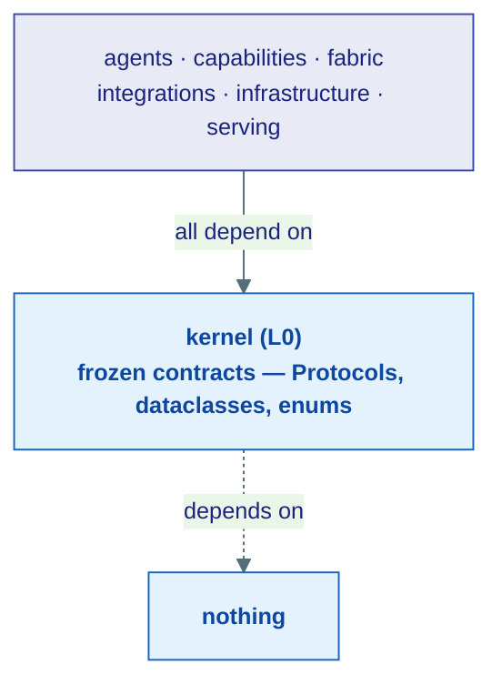
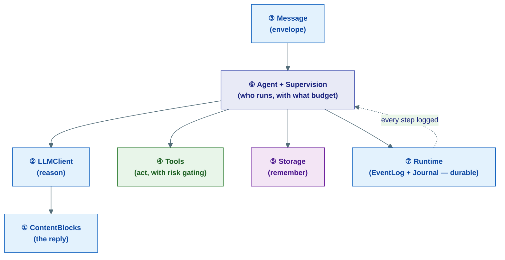

# The Kernel

## What the kernel is (in one breath)

The kernel is the **rulebook** every other part of the framework agrees to follow. It contains no working machinery — no database code, no network calls, no LLM clients. Just **contracts**: Python `Protocol`s, `dataclass`es, and `enum`s that say *"anything claiming to be an X must have these methods and these fields."*

!!! tip "The analogy"
    Think of the kernel as the **shape of the electrical sockets** in a country. The kernel doesn't generate electricity (that's the power plant) and it isn't your toaster (that's a tool). It's the agreed-upon socket shape that lets any appliance plug into any wall. Because everyone agrees on the socket, you can swap the power plant (in-memory → Postgres) or the toaster (OpenAI → Anthropic) without rewiring the house.

This is why the kernel is **frozen** (layer L0): it imports nothing from the rest of the codebase, has a strict size ceiling, and contains zero I/O. Everything above it depends on it; it depends on nothing.

---

## Why contracts instead of code?

Because it lets the framework swap *implementations* freely while the *agent code never changes*:

- The same `LLMClient` contract is satisfied by the OpenAI, Anthropic, Gemini, and Ollama clients.
- The same `HistoryProvider` contract is satisfied by in-memory, Redis, and Postgres backends.
- The same `EventLog` and `Journal` contracts are satisfied by in-process dicts (dev) and Postgres + Redis (production).

Write your agent against the contract once. Pick the backend at startup. That single idea is what makes the framework testable in-memory and durable in production with no code fork.

!!! note "Concepts vs. Kernel pages"
    The [Core Concepts](../concepts/index.md) section explains *how things work* at a story level. These kernel pages are the **contract-level companion** — the exact Protocols and fields. Read a concept page for the intuition, then come here for the precise shape.

---

## The seven contracts, in reading order

Each page opens with a plain-English explanation and a real-world analogy, then shows the actual contract, with diagrams throughout. Read top to bottom — each builds on the last.

| # | Page | Plain-English question it answers | Analogy |
|---|------|-----------------------------------|---------|
| 1 | [Core — Content & Identity](01-core.md) | What is a message made of, and how do agents get addresses? | Lego bricks + postal addresses |
| 2 | [The LLM Contract](02-llm.md) | How does the framework talk to *any* model the same way? | A universal remote |
| 3 | [Messaging & Streaming](03-messaging.md) | How do agents send each other envelopes and stream live output? | Postal envelopes + a news ticker |
| 4 | [Tools, Skills & Approval](04-tools.md) | How does an agent take actions, and how are risky ones gated? | Apps + parental controls |
| 5 | [Storage Contracts](05-storage.md) | Where do memories, files, vectors, and graphs live? | Different filing cabinets |
| 6 | [Agent Policy](06-agent.md) | Who reports to whom, and what is each agent allowed to spend? | An org chart + an allowance |
| 7 | [The Durable Runtime](07-runtime.md) | How does a run survive a crash and pick up where it stopped? | A ship's logbook + a receipts drawer |

---

## How the pieces snap together

A single agent run touches almost every kernel contract. Here is the whole rulebook on one map — follow the numbers from the reading order above:

---

## A few kernel-wide rules worth knowing early

!!! warning "ContentBlocks are a union — check the type"
    Only `TextBlock` has a `.text` attribute. When you iterate a message's `content`, you must `isinstance(block, TextBlock)` before reading `.text`. See [Core](01-core.md).

!!! warning "Usage uses input/output, not prompt/completion"
    Token counts are `input_tokens` / `output_tokens` / `cached_tokens` / `reasoning_tokens` — not the OpenAI-style `prompt_tokens` / `completion_tokens`. See [Core](01-core.md).

!!! note "Some iterator methods are sync defs that *return* an async iterator"
    `EventLog.read` / `EventLog.tail` and `FollowGraph.followers_of` / `following` are **synchronous** methods that return an `AsyncIterator` — you write `async for x in log.read(...)` without `await`ing the call itself. See [Runtime](07-runtime.md).

---

**Start here:** [Core — Content & Identity](01-core.md)
