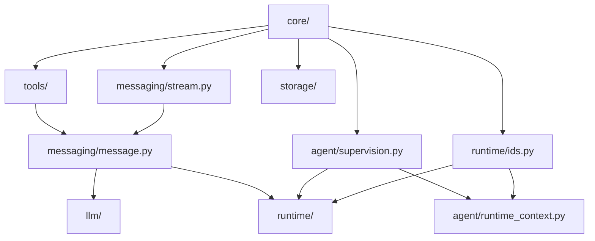

# Kernel — Architecture Overview

> **The kernel is L0 — frozen.** It contains only Protocols, dataclasses, and enums. No I/O, no concrete implementations, no imports from any higher layer. Every layer above (agents → capabilities → fabric → serving) builds on it.

## What Lives Here

| File | What it answers |
|---|---|
| [01 — core](01-core.md) | What data flows everywhere? (ContentBlock, identity, errors) |
| [02 — llm](02-llm.md) | How do we talk to an AI model? |
| [03 — messaging](03-messaging.md) | How do agents communicate? |
| [04 — tools](04-tools.md) | What can an agent do? |
| [05 — agent](05-agent.md) | What IS an agent? How is it supervised? |
| [06 — storage](06-storage.md) | What does an agent remember? |
| [07 — runtime](07-runtime.md) | How does a run stay alive across crashes? |

---

## Subpackage Map

We structure the kernel into logical packages defining distinct interfaces:

| Package | Description | Core Components |
|---|---|---|
| `core/` | Universal primitives | `ContentBlock`, `ChatMessage`, `AgentId`, `TopicId`, `Usage`, `KernelErrors` |
| `llm/` | Model API contracts | `LLMClient`, `EmbeddingClient`, `GenerationOptions`, `LLMResponse` |
| `messaging/` | Agent communication | `Message` envelope, stream events, `Event` bus |
| `tools/` | Tool & skill execution | `BaseTool`, `HostedTool`, `ToolRisk`, `HitlMode` |
| `agent/` | Identity & supervision | `Agent` protocol, `Supervision`, `RunMeta`, `CancellationToken`, `Middleware` |
| `storage/` | State & memory providers | `HistoryProvider`, `ShortTermMemory`, `LongTermMemory`, `VectorStore`, `GraphStore`, `TaskStore` |
| `runtime/` | Durable execution machinery | `EventLog`, `Inbox`, `Scheduler`, `Journal`, `Wakeup`, `Supervisor` |

---

## Dependency Rule

Imports within the kernel flow in one direction only:

---

## The Staged Implementation Model

Every kernel Protocol has concrete implementations at higher layers. The engine ships Stage 0 and Stage 1 out of the box:

| Kernel Protocol | Stage 0 (in-process) | Stage 1 (durable) |
|---|---|---|
| `EventLog` | In-memory list | Postgres append-only table |
| `Inbox` | In-memory deque | Postgres `(agent_id, msg_id)` table |
| `Scheduler` | asyncio priority queue | `SELECT FOR UPDATE SKIP LOCKED` |
| `Journal` | In-memory dict | Redis (hot) + Postgres (cold) |
| `HistoryProvider` | `InMemoryHistoryProvider` | `PostgresHistoryProvider` |
| `VectorStore` | — | `PgVectorStore` |
| `GraphStore` | — | `AGEGraphStore` |

Switch backends by changing the wiring in `infrastructure/serving_factory.py`. Agent code never changes.
