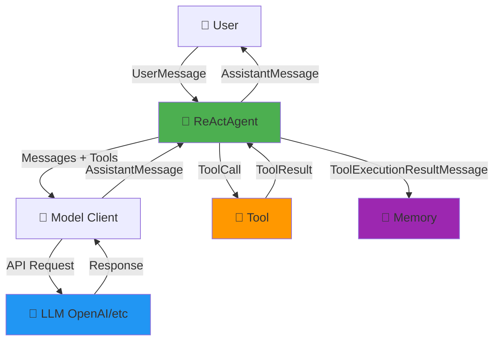
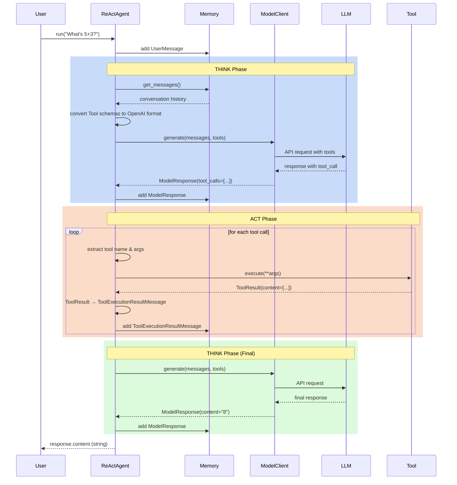
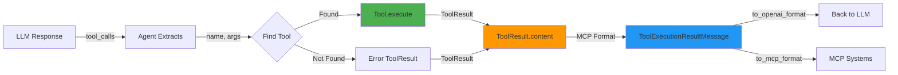
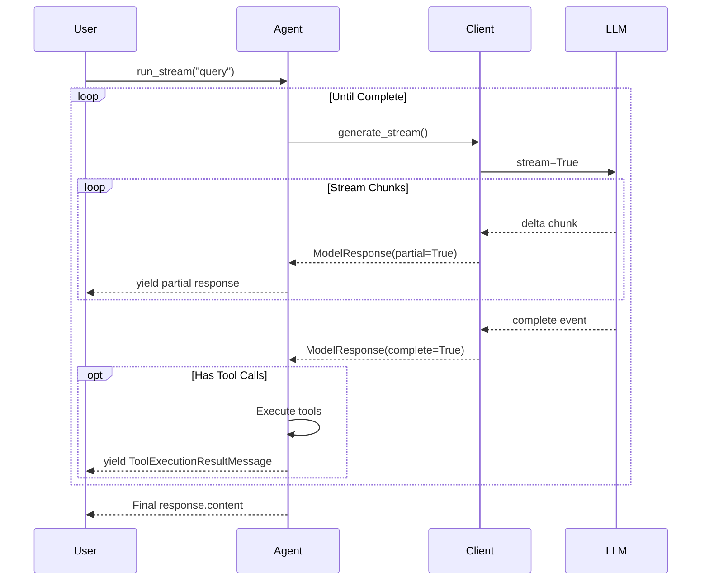
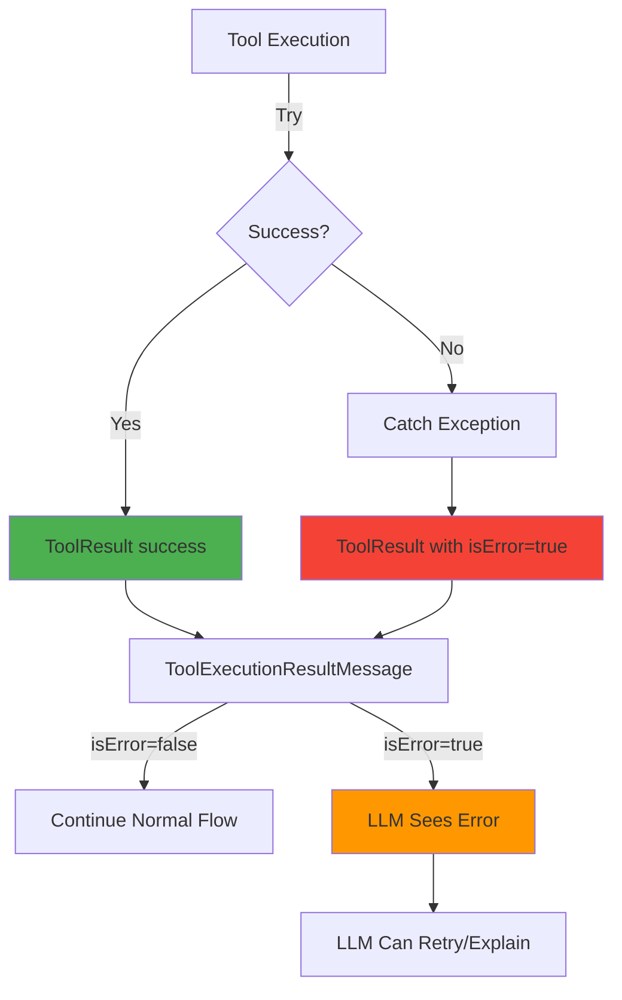

# Data Flow Architecture

Visual representation of data flows in the agent framework.

## Overall System Architecture



## Message Type Hierarchy

```
┌─────────────────────────────────────────────────────────────┐
│                    Message Architecture                      │
├─────────────────────────────────────────────────────────────┤
│                                                              │
│  ┌──────────────────────┐      ┌──────────────────────┐   │
│  │  BaseClientMessage   │      │  BaseAgentMessage    │   │
│  │  (LLM Communication) │      │  (Agent-to-Agent)    │   │
│  └──────────┬───────────┘      └──────────┬───────────┘   │
│             │                               │               │
│    ┌────────┴────────┐              ┌──────┴─────────┐    │
│    │                 │              │                │     │
│    ▼                 ▼              ▼                ▼     │
│  SystemMessage   UserMessage   UserAgentMessage  AgentR..│
│  AssistantMessage              (future multi-agent)       │
│  ToolCallMessage                                          │
│  ToolExecutionResultMessage                               │
│                                                            │
└────────────────────────────────────────────────────────────┘
```

## ReAct Agent Loop (Single Iteration)



## Tool Execution Flow (MCP-Native)



## MCP-Native Tool Schema Conversion

```
┌─────────────────────────────────────────────────────────────┐
│                    Tool Schema Flow                          │
└─────────────────────────────────────────────────────────────┘

  Tool Definition (Python)
         │
         ▼
  ┌──────────────────────┐
  │   Tool (MCP Native)  │
  │  • name              │
  │  • description       │
  │  • inputSchema ◄─────┼─── Source of Truth
  └──────────┬───────────┘
             │
        ┌────┴────┐
        │         │
        ▼         ▼
  to_mcp_format()  to_openai_format()
        │              │
        ▼              ▼
   ┌─────────┐    ┌──────────────┐
   │   MCP   │    │   OpenAI     │
   │ Format  │    │   Format     │
   │{name,   │    │{type:func,   │
   │ input   │    │ function:{   │
   │ Schema} │    │  params}}    │
   └─────────┘    └──────────────┘
        │              │
        ▼              ▼
   MCP Systems    OpenAI API
```

## Tool Result Content Blocks (MCP Format)

```
┌──────────────────────────────────────────────────────────┐
│              ToolResult Content Types                     │
├──────────────────────────────────────────────────────────┤
│                                                           │
│  Text Content:                                            │
│  {                                                        │
│    "type": "text",                                        │
│    "text": "{\"result\": 42}"                            │
│  }                                                        │
│                                                           │
│  Image Content:                                           │
│  {                                                        │
│    "type": "image",                                       │
│    "data": "base64...",                                   │
│    "mimeType": "image/png"                               │
│  }                                                        │
│                                                           │
│  Resource Content:                                        │
│  {                                                        │
│    "type": "resource",                                    │
│    "resource": {                                          │
│      "uri": "file:///path/to/file",                      │
│      "text": "content"                                    │
│    }                                                      │
│  }                                                        │
│                                                           │
└──────────────────────────────────────────────────────────┘
```

## Message Flow: User Input → Agent Response

```
┌─────────────┐
│    User     │ "Calculate 5 + 3"
└──────┬──────┘
       │
       ▼
┌──────────────────────────────────────┐
│  UserMessage                         │
│  role: "user"                        │
│  content: ["Calculate 5 + 3"]       │
└──────┬───────────────────────────────┘
       │
       ▼
┌──────────────────────────────────────┐
│  ReActAgent                          │
│  • Adds to Memory                    │
│  • Calls Model with Tools            │
└──────┬───────────────────────────────┘
       │
       ▼
┌──────────────────────────────────────┐
│  ModelResponse #1                    │
│  role: "assistant"                   │
│  content: ""                         │
│  tool_calls: [ToolCallMessage{       │
│    id: "call_123",                   │
│    name: "calculator",               │
│    arguments: {expression: "5+3"}    │
│  }]                                  │
└──────┬───────────────────────────────┘
       │
       ▼
┌──────────────────────────────────────┐
│  Tool Execution                      │
│  calculator.execute("5+3")           │
└──────┬───────────────────────────────┘
       │
       ▼
┌──────────────────────────────────────┐
│  ToolResult                          │
│  content: [{                         │
│    type: "text",                     │
│    text: '{"result": 8}'             │
│  }]                                  │
│  isError: false                      │
└──────┬───────────────────────────────┘
       │
       ▼
┌──────────────────────────────────────┐
│  ToolExecutionResultMessage          │
│  role: "tool_response"               │
│  tool_call_id: "call_123"            │
│  content: [{type:"text", text:...}]  │
└──────┬───────────────────────────────┘
       │
       ▼
┌──────────────────────────────────────┐
│  ModelResponse (final)               │
│  role: "assistant"                   │
│  content: "The result is 8"          │
│  tool_calls: None                    │
│  finish_reason: "stop"               │
└──────┬───────────────────────────────┘
       │
       ▼
┌──────────────────────────────────────┐
│  Agent Returns                       │
│  response.content → "The result is 8"│
└──────┬───────────────────────────────┘
       │
       ▼
┌──────────────┐
│  User sees:  │ "The result is 8"
└──────────────┘
```

## Streaming Data Flow



## Memory State Evolution

```
Initial State:
┌────────────────┐
│    Memory      │
│    []          │
└────────────────┘

After User Message:
┌────────────────┐
│    Memory      │
│ [UserMessage]  │
└────────────────┘

After First LLM Call:
┌────────────────────────┐
│       Memory           │
│ [UserMessage,          │
│  ModelResponse]        │
└────────────────────────┘

After Tool Execution:
┌─────────────────────────────────┐
│          Memory                 │
│ [UserMessage,                   │
│  ModelResponse (tool_calls),    │
│  ToolExecutionResultMessage]    │
└─────────────────────────────────┘

After Final Response:
┌─────────────────────────────────┐
│          Memory                 │
│ [UserMessage,                   │
│  ModelResponse (tool_calls),    │
│  ToolExecutionResultMessage,    │
│  ModelResponse (final)]         │
└─────────────────────────────────┘
```

## ModelResponse vs Client Messages

```
┌──────────────────────────────────────────────────────────────┐
│                  ModelResponse Explained                      │
├──────────────────────────────────────────────────────────────┤
│                                                               │
│  ModelResponse extends BaseClientMessage                      │
│  Purpose: Wrap LLM API response with metadata                │
│                                                               │
│  Fields:                                                      │
│  • role: "assistant" (inherited from BaseClientMessage)       │
│  • content: str (the actual text response)                    │
│  • tool_calls: Optional[List[ToolCallMessage]]               │
│  • usage: Optional[Dict] (token usage stats)                 │
│  • model: Optional[str] (model name used)                    │
│  • finish_reason: Optional[str] ("stop", "length", etc.)     │
│                                                               │
│  Flow:                                                        │
│  LLM API → ModelClient → ModelResponse → Agent               │
│                                          ↓                    │
│                                    Stored in Memory           │
│                                          ↓                    │
│                              Agent returns response.content   │
│                                                               │
└──────────────────────────────────────────────────────────────┘
```

## Client Messages vs Agent Messages

```
┌──────────────────────────────────────────────────────────────┐
│                    Message Separation                         │
├──────────────────────────────────────────────────────────────┤
│                                                               │
│  CLIENT MESSAGES (BaseClientMessage)                         │
│  Purpose: Agent ↔ LLM Communication                          │
│  ┌─────────────────────────────────────────────────────┐    │
│  │ • SystemMessage        - System instructions        │    │
│  │ • UserMessage          - User input to agent        │    │
│  │ • AssistantMessage     - LLM response               │    │
│  │ • ToolCallMessage      - Tool invocation request    │    │
│  │ • ToolExecutionResult  - Tool execution result      │    │
│  └─────────────────────────────────────────────────────┘    │
│         │                                                     │
│         │ Used in Memory & Model Client API                  │
│         ▼                                                     │
│  ┌──────────────────┐    ┌─────────────────────┐           │
│  │   ReActAgent     │◄──►│   ModelClient       │           │
│  │   Memory         │    │   (OpenAI, etc.)    │           │
│  └──────────────────┘    └─────────────────────┘           │
│                                                               │
│  AGENT MESSAGES (BaseAgentMessage)                           │
│  Purpose: Agent ↔ Agent Communication (Multi-Agent)          │
│  ┌─────────────────────────────────────────────────────┐    │
│  │ • UserAgentMessage     - User to agent wrapper      │    │
│  │ • AgentResponseMessage - Agent to user/agent        │    │
│  └─────────────────────────────────────────────────────┘    │
│         │                                                     │
│         │ Can convert to ClientMessages                      │
│         ▼                                                     │
│  ┌──────────────────────────────────────────────────────┐   │
│  │  to_model_client_message()                           │   │
│  │  Converts agent messages → client messages           │   │
│  └──────────────────────────────────────────────────────┘   │
│                                                               │
└──────────────────────────────────────────────────────────────┘
```

## Model Client Architecture

```
┌────────────────────────────────────────────────────────────┐
│                 BaseModelClient (Abstract)                  │
├────────────────────────────────────────────────────────────┤
│  + generate(messages, tools) → ModelResponse               │
│  + generate_stream(messages, tools) → Iterator             │
└────────────────┬───────────────────────────────────────────┘
                 │
                 │ Implements
                 │
                 ▼
┌────────────────────────────────────────────────────────────┐
│              OpenAIClient                                   │
├────────────────────────────────────────────────────────────┤
│  • Uses OpenAI Responses API                               │
│  • Converts messages to OpenAI format                      │
│  • Handles streaming with delta accumulation               │
│  • Returns ModelResponse with tool_calls                   │
└────────────────────────────────────────────────────────────┘

Message Conversion Flow:
  BaseClientMessage[] → to_dict() → OpenAI API Format
                                          ↓
                                    OpenAI API
                                          ↓
                                    API Response
                                          ↓
                           ModelResponse ← parse
```

## Error Handling Flow



## Tool Schema Validation

```
Developer Defines Tool
         ↓
┌─────────────────────┐
│  Tool(              │
│    name="calc",     │
│    inputSchema={    │ ← JSON Schema validation
│      type: object,  │
│      properties: {} │
│    }                │
│  )                  │
└─────────┬───────────┘
          │
          ▼
┌─────────────────────┐
│  Pydantic Validates │
│  • Schema structure │
│  • Required fields  │
└─────────┬───────────┘
          │
          ▼
┌─────────────────────┐
│  Runtime Validation │
│  LLM provides args  │
│  → Match schema     │
└─────────┬───────────┘
          │
          ▼
    Tool.execute(**validated_args)
```

## Complete Request-Response Cycle

```
1. User Request
   ↓
2. Agent receives UserMessage → Memory
   ↓
3. Agent.run() starts ReAct loop
   ↓
4. THINK: Generate with tools
   ↓
5. ModelClient converts Tool schemas to OpenAI format
   ↓
6. OpenAI API called with messages + tools
   ↓
7. Response: ModelResponse with tool_calls → Memory
   ↓
8. ACT: For each tool_call:
   ↓
   a. Extract name & arguments
   ↓
   b. Find tool in agent.tools
   ↓
   c. tool.execute(**args) → ToolResult (MCP format)
   ↓
   d. ToolResult → ToolExecutionResultMessage → Memory
   ↓
9. THINK: Generate again with tool results
   ↓
10. OpenAI API called with updated conversation
    ↓
11. Response: Final ModelResponse → Memory
    ↓
12. Agent extracts response.content
    ↓
13. Return content string to User
```

## Key Design Principles

### 1. MCP-Native First
```
Internal Representation = MCP Format
         ↓
   Adapters for providers (OpenAI, Anthropic, etc.)
```

### 2. Separation of Concerns
```
ClientMessages ← → Agent ← → ModelClient
                   ↕
               AgentMessages (multi-agent)
```

### 3. Structured Results
```
Tool.execute() → ToolResult {
  content: List[ContentBlock],
  isError: bool
}
```

### 4. Type Safety
```
Pydantic Models Everywhere
    ↓
Validation at Runtime
    ↓
Better Error Messages
```
